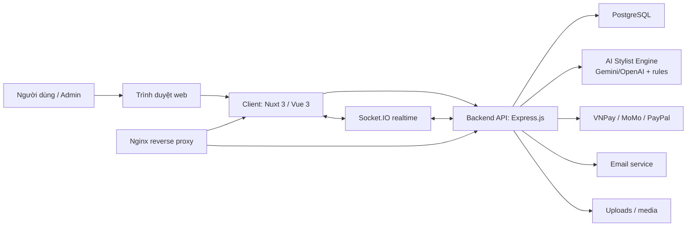
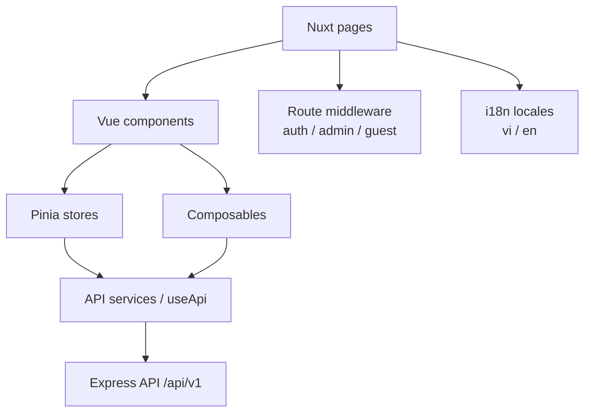
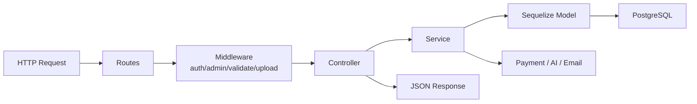
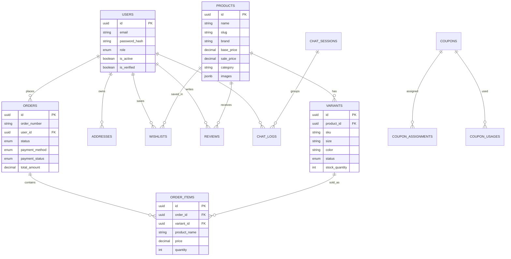
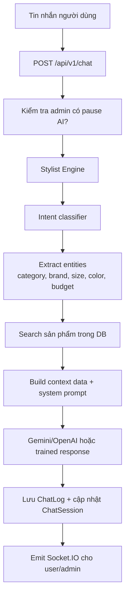
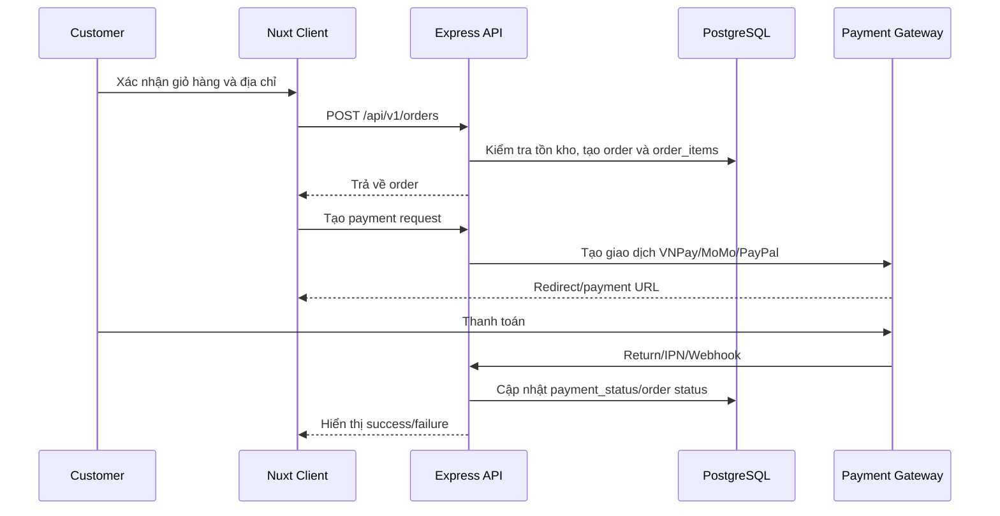
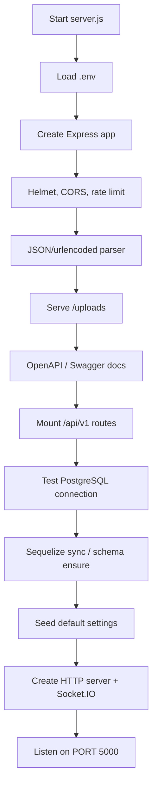
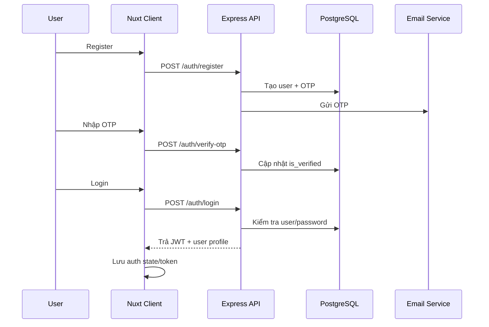
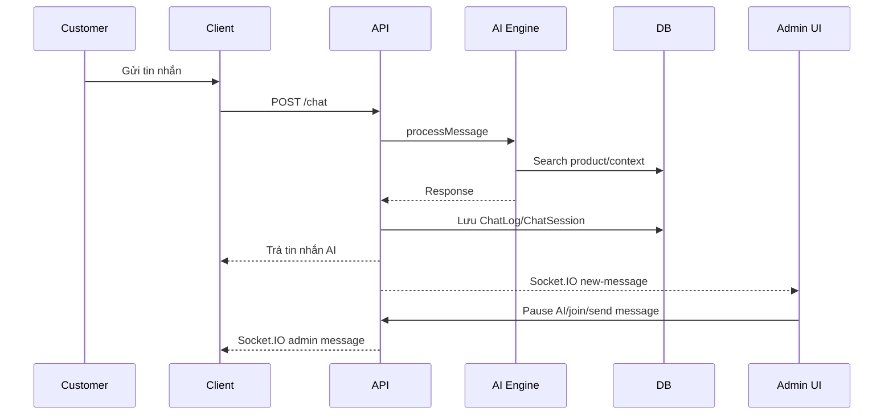

# AURA ARCHIVE - Tài liệu chi tiết phục vụ thiết kế PPTX

> Dự án: **AURA ARCHIVE**
> Chủ đề: **Nền tảng thương mại điện tử thời trang cao cấp resale/consignment tích hợp AI Stylist**
> Mục đích: cung cấp nội dung chi tiết để chuyển thành slide thuyết trình, báo cáo khóa luận hoặc kịch bản demo.
> Ngày lập tài liệu: **2026-05-06**
> Phạm vi: bám theo mã nguồn hiện có trong repo `D:\KLTN`.

---

## 1. Ghi chú trước khi làm PPT

### 1.1. Cách dùng tài liệu

- Phần **Bố cục PPT đề xuất** có thể dùng trực tiếp làm danh sách slide.
- Phần **Nội dung chi tiết theo chương** dùng để viết speaker notes hoặc mở rộng nội dung thuyết trình.
- Các sơ đồ Mermaid có thể xuất thành ảnh rồi đưa vào PowerPoint.
- Các bảng tổng hợp phù hợp để đưa vào slide dạng table.

### 1.2. Ghi chú hiện trạng mã nguồn

- Repo hiện tại có hai ứng dụng chính: `client` và `server`.
- Frontend dùng Nuxt 3, Vue 3, Tailwind CSS, Pinia và i18n.
- Backend dùng Express.js, PostgreSQL, Sequelize, Socket.IO và Swagger/OpenAPI.
- AI Stylist hiện được tích hợp trực tiếp trong backend Node.js qua `server/src/services/ai.service.js`, `server/src/services/ai/*` và `server/src/services/voice.service.js`.
- Các tài liệu chính đã được đồng bộ theo hiện trạng mới: **AI được tích hợp trong Node.js backend**, không chạy FastAPI service riêng.
- `nginx.conf` đã được đồng bộ với Docker Compose: chỉ proxy `client`, `server`, `/uploads` và `/socket.io/`.

---

## 2. Bố cục PPT đề xuất

### Slide 1 - Trang bìa

**Tiêu đề:** AURA ARCHIVE
**Phụ đề:** Luxury Resell & Consignment Fashion E-commerce Platform tích hợp AI Stylist

**Nội dung nên có:**

- Tên sinh viên hoặc nhóm thực hiện.
- Tên giảng viên hướng dẫn.
- Khoa, bộ môn, trường.
- Năm học.
- Ảnh minh họa homepage, sản phẩm hoặc giao diện AI chat.

**Thông điệp chính:**
AURA ARCHIVE là nền tảng thương mại điện tử thời trang cao cấp đã qua sử dụng, kết hợp trải nghiệm mua sắm hiện đại với trợ lý AI tư vấn cá nhân hóa.

---

### Slide 2 - Lý do chọn đề tài

**Ý chính:**

- Thương mại điện tử phát triển mạnh, người dùng quen với mua sắm trực tuyến.
- Phân khúc luxury resale/consignment có nhu cầu riêng: hàng chính hãng, tình trạng sản phẩm, độ tin cậy và trải nghiệm cao cấp.
- Khách hàng cần được tư vấn về phong cách, kích cỡ, chất liệu, tình trạng hàng và mức giá.
- AI có thể hỗ trợ khám phá sản phẩm, tăng khả năng chuyển đổi và giảm tải cho chăm sóc khách hàng.

**Nội dung ngắn cho slide:**
Đề tài được chọn nhằm xây dựng một hệ thống e-commerce có tính ứng dụng thực tế, vừa đáp ứng quy trình mua bán sản phẩm thời trang cao cấp, vừa khai thác AI để tạo trải nghiệm tư vấn cá nhân hóa cho người dùng.

---

### Slide 3 - Vấn đề cần giải quyết

**Các vấn đề chính:**

- Người mua hàng luxury secondhand thường khó ra quyết định vì thiếu thông tin về tình trạng, size, chất liệu và độ chính hãng.
- Website e-commerce thông thường chỉ hiển thị danh sách sản phẩm, chưa có tư vấn theo ngữ cảnh.
- Quản trị viên cần hệ thống tập trung để quản lý sản phẩm, biến thể, đơn hàng, người dùng, voucher, nội dung marketing và chat.
- Cần đồng bộ nhiều nghiệp vụ: giỏ hàng, thanh toán, tồn kho, review, khuyến mãi, thông báo và chăm sóc khách hàng.

**Thông điệp slide:**
Bài toán không chỉ là bán hàng online, mà là xây dựng một trải nghiệm luxury commerce có độ tin cậy, có tư vấn và có hệ thống quản trị đầy đủ.

---

### Slide 4 - Mục tiêu đề tài

**Mục tiêu tổng quát:**
Xây dựng nền tảng thương mại điện tử full-stack cho thời trang cao cấp resale/consignment, có khả năng vận hành thực tế và tích hợp AI Stylist.

**Mục tiêu cụ thể:**

- Xây dựng frontend Nuxt 3 có giao diện cao cấp, responsive, hỗ trợ tiếng Việt và tiếng Anh.
- Xây dựng backend REST API bằng Express.js, Sequelize và PostgreSQL.
- Quản lý đầy đủ nghiệp vụ e-commerce: sản phẩm, biến thể, giỏ hàng, checkout, đơn hàng, thanh toán, review, wishlist.
- Xây dựng khu vực admin dashboard để quản trị dữ liệu và theo dõi hoạt động.
- Tích hợp AI chat và voice assistant để tư vấn sản phẩm theo ngữ cảnh.
- Hỗ trợ triển khai bằng Docker Compose và reverse proxy Nginx.

---

### Slide 5 - Phạm vi đề tài

**Trong phạm vi:**

- Website khách hàng.
- Đăng ký, đăng nhập, OTP, OAuth.
- Catalog sản phẩm, tìm kiếm, lọc, xem chi tiết.
- Giỏ hàng, checkout, đơn hàng, thanh toán.
- Wishlist, địa chỉ, review, coupon.
- Admin dashboard.
- Quản lý sản phẩm, biến thể, đơn hàng, user, banner, blog, popup, page content.
- AI Stylist chat, voice và Live2D mascot.
- Docker, Nginx, PostgreSQL.

**Ngoài phạm vi hiện tại:**

- Mobile app native.
- Hệ thống kho phức tạp nhiều chi nhánh.
- ERP/CRM enterprise riêng.
- Ứng dụng AI training tách biệt ngoài backend hiện tại.

---

### Slide 6 - Tổng quan sản phẩm

**Mô tả ngắn:**
**AURA ARCHIVE** là website thương mại điện tử chuyên về thời trang cao cấp đã qua sử dụng, với định hướng trải nghiệm sang trọng, tập trung vào hàng designer, resale, consignment và tư vấn phong cách bằng AI.

**Giá trị cốt lõi:**

- Mua sắm hàng cao cấp đã qua sử dụng một cách trực quan và đáng tin cậy.
- Quản lý từng biến thể/sản phẩm vật lý riêng biệt, phù hợp mô hình resale.
- Hỗ trợ khách hàng qua AI Stylist, có thể tư vấn dựa trên sản phẩm thật trong database.
- Admin có thể vận hành website, nội dung, khuyến mãi và chat trong một hệ thống.

---

### Slide 7 - Đối tượng người dùng

| Actor | Vai trò | Nhu cầu chính |
|---|---|---|
| Guest | Khách chưa đăng nhập | Xem sản phẩm, tìm kiếm, đọc blog, chat với AI, đăng ký/đăng nhập |
| Customer | Khách đã có tài khoản | Mua hàng, quản lý hồ sơ, địa chỉ, wishlist, đơn hàng, review |
| Admin | Quản trị viên | Quản lý sản phẩm, đơn hàng, user, coupon, nội dung, AI config, chat |
| Payment Gateway | Cổng thanh toán | Xử lý giao dịch, callback, webhook/IPN |
| AI Provider | Gemini/OpenAI | Tạo phản hồi tư vấn chat/voice |
| Email Service | Dịch vụ email | Gửi OTP, quên mật khẩu, thông báo |

---

### Slide 8 - Kiến trúc tổng quan



**Diễn giải:**

- Client Nuxt hiển thị giao diện và gọi API qua `/api/v1`.
- Backend Express xử lý nghiệp vụ, bảo mật, database, thanh toán, AI và realtime chat.
- PostgreSQL lưu dữ liệu người dùng, sản phẩm, biến thể, đơn hàng, review, coupon, chat log và site settings.
- Socket.IO dùng cho luồng chat/admin realtime.
- Nginx đóng vai trò reverse proxy trong môi trường Docker production.

---

### Slide 9 - Công nghệ sử dụng

| Lớp | Công nghệ | Vai trò |
|---|---|---|
| Frontend | Nuxt 3, Vue 3 | Xây dựng app, routing và giao diện |
| UI/CSS | Tailwind CSS, Headless UI, Heroicons | Tạo giao diện responsive và component UI |
| State | Pinia, persisted state | Quản lý auth, cart, product, user, notification |
| i18n | `@nuxtjs/i18n` | Hỗ trợ song ngữ Việt/Anh |
| Backend | Express.js | REST API và server core |
| ORM | Sequelize | Model, association, truy vấn PostgreSQL |
| Database | PostgreSQL | Lưu trữ dữ liệu hệ thống |
| Realtime | Socket.IO | Chat realtime giữa user/admin |
| AI | Gemini/OpenAI SDK | AI chat, voice, product advisory |
| Payment | VNPay, MoMo, PayPal | Thanh toán trực tuyến |
| Docs | Swagger UI/OpenAPI | Tài liệu API |
| DevOps | Docker Compose, Nginx | Đóng gói và triển khai |

---

### Slide 10 - Cấu trúc thư mục

```text
KLTN/
├── client/              # Frontend Nuxt 3
│   ├── pages/           # Route pages customer/admin/auth/payment
│   ├── components/      # Component UI
│   ├── composables/     # Reusable frontend logic
│   ├── stores/          # Pinia stores
│   ├── services/        # API client layer
│   ├── locales/         # en.json, vi.json
│   └── assets/          # CSS, images, static UI assets
├── server/              # Backend Express.js
│   ├── server.js        # Entry point
│   └── src/
│       ├── controllers/ # Request handlers
│       ├── services/    # Business logic
│       ├── models/      # Sequelize models
│       ├── routes/      # API route definitions
│       ├── middlewares/ # Auth, admin, validation, upload, error
│       ├── docs/        # OpenAPI builder
│       ├── socket.js    # Socket.IO
│       └── utils/       # Logger, token, seeder, email
├── docker-compose.yml
├── nginx.conf
├── README.md
├── SRS.md
└── PROJECT_ANALYSIS.md
```

---

### Slide 11 - Frontend: các màn hình chính

**Customer pages:**

- Homepage: hero, featured products, new arrivals, brand showcase.
- Shop: danh sách sản phẩm, filter, search, category/brand.
- Product detail: gallery, biến thể, size, review, related products, add to cart, wishlist.
- Cart/Checkout: giỏ hàng, tổng tiền, shipping, coupon, phương thức thanh toán.
- Account: profile, địa chỉ, wishlist, lịch sử đơn hàng, chi tiết đơn hàng.
- Blog, contact, FAQ, privacy, shipping, returns.

**Admin pages:**

- Dashboard thống kê.
- Products CRUD và variants.
- Orders list/detail/print/status management.
- Users list/detail/status.
- Coupons, reviews, banners, blogs, popups.
- Page builder và page content.
- AI config, chat management, notification.
- Settings: site, payment, product attributes.

---

### Slide 12 - Frontend: kiến trúc client



**Điểm nổi bật:**

- `client/pages` tương ứng với route thực tế của Nuxt.
- `client/middleware` bảo vệ route cần đăng nhập và admin.
- `client/stores` quản lý auth, cart, user, product, notification.
- `client/composables` đóng gói logic dùng lại: API, auth token, cart, compare, currency, socket, Live2D, page content.
- `client/locales/en.json` và `client/locales/vi.json` hỗ trợ song ngữ.

---

### Slide 13 - Backend: MVC + Service Layer



**Diễn giải:**

- **Routes:** khai báo endpoint và gắn middleware.
- **Middleware:** xử lý JWT, role admin, validate input, upload file, error handling.
- **Controller:** nhận request, kiểm tra tham số, gọi service, trả response.
- **Service:** chứa business logic chính, tách khỏi HTTP layer.
- **Model:** định nghĩa schema Sequelize và quan hệ bảng.

---

### Slide 14 - API endpoints chính

| Module | Endpoint nhóm | Chức năng |
|---|---|---|
| Auth | `/api/v1/auth/*` | Register, verify OTP, resend OTP, login, forgot/reset password, OAuth, get profile |
| Products | `/api/v1/products/*` | List, detail, featured, new arrivals, sale, categories, brands, related |
| Orders | `/api/v1/orders/*` | Tạo đơn, lịch sử đơn, chi tiết, cancel, availability |
| Payments | `/api/v1/payments/*` | VNPay, MoMo, PayPal create/return/IPN/webhook |
| Wishlist | `/api/v1/wishlist/*` | Xem, thêm, xóa, kiểm tra wishlist |
| Reviews | `/api/v1/products/:id/reviews` | Review, rating summary, helpful, eligibility |
| Coupons | `/api/v1/coupons/*` | Public coupons, validate, my coupons |
| Chat | `/api/v1/chat/*` | AI chat, greeting, health, history, appearance, voice token |
| Admin | `/api/v1/admin/*` | Dashboard, products, variants, orders, users, reviews, coupons, settings, chat |
| Content | `/api/v1/blogs`, `/banners`, `/popups`, `/page-content` | Nội dung marketing và static pages |
| Settings | `/api/v1/settings/*` | Public site settings, product attributes |

---

### Slide 15 - Cơ sở dữ liệu

**Nhóm bảng chính:**

- **Người dùng:** `users`, `addresses`, `notifications`
- **Sản phẩm:** `products`, `variants`, `reviews`, `wishlists`
- **Đơn hàng:** `orders`, `order_items`
- **Khuyến mãi:** `coupons`, `coupon_usages`, `coupon_assignments`
- **AI/chat:** `system_prompts`, `chat_logs`, `chat_sessions`
- **Nội dung:** `banners`, `blogs`, `popups`, `page_contents`, `site_settings`
- **Vận hành:** `abandoned_carts`, `newsletter`

**Điểm thiết kế quan trọng:**

- Dùng UUID làm khóa chính cho nhiều bảng.
- Dùng `variants` để đại diện cho từng item vật lý trong mô hình resale.
- Đơn hàng lưu snapshot thông tin sản phẩm trong `order_items` để bảo toàn lịch sử giá, tên, brand tại thời điểm mua.
- Cấu hình website, prompt AI và page content được lưu database để admin có thể thay đổi không cần sửa code.

---

### Slide 16 - Sơ đồ ERD rút gọn



---

### Slide 17 - Module khách hàng

**Chức năng tài khoản:**

- Đăng ký tài khoản.
- Xác thực OTP.
- Đăng nhập bằng email/password.
- Đăng nhập Google/Facebook.
- Quên mật khẩu, reset password.
- Quản lý profile và đổi mật khẩu.

**Chức năng mua sắm:**

- Xem danh sách sản phẩm.
- Lọc theo danh mục, thương hiệu, giá, thuộc tính.
- Xem chi tiết sản phẩm và biến thể.
- Thêm giỏ hàng, so sánh, wishlist.
- Checkout, nhập địa chỉ, tính shipping, dùng coupon.
- Thanh toán bằng COD, bank transfer, VNPay, MoMo, PayPal tùy cấu hình.
- Xem lịch sử và chi tiết đơn hàng.
- Viết review sau khi đủ điều kiện.

---

### Slide 18 - Module quản trị Admin

**Dashboard và vận hành:**

- Thống kê tổng quan.
- Doanh thu theo tháng.
- Đơn hàng gần đây.
- Quản lý thông báo.

**Quản lý thương mại:**

- CRUD sản phẩm.
- Quản lý biến thể theo size, màu, chất liệu, SKU, trạng thái.
- Quản lý đơn hàng, cập nhật trạng thái đơn và thanh toán.
- Quản lý user, active/deactivate, xem chi tiết.
- Quản lý coupon, phạm vi áp dụng, giới hạn sử dụng.
- Quản lý review và kiểm duyệt nội dung.

**Quản lý nội dung và AI:**

- Banner, blog, popup.
- Page builder/page content.
- Site settings, payment settings, product attributes.
- System prompts, chat appearance, voice config.
- Admin chat: xem session, tạm dừng AI, tham gia chat, gửi tin nhắn, đóng/mở lại session.

---

### Slide 19 - AI Stylist Chat

**Mục tiêu:**
AI Stylist đóng vai trò tư vấn thời trang, giúp khách hàng tìm sản phẩm phù hợp, trả lời về giá, size, tình trạng, tồn kho và gợi ý phối đồ.



**Điểm nổi bật:**

- Có session memory để giữ ngữ cảnh hội thoại.
- Ưu tiên sử dụng dữ liệu sản phẩm thật trong database.
- Có fallback nếu không cấu hình API key.
- Admin có thể tạm dừng AI và tham gia hội thoại trực tiếp.
- Lịch sử chat được lưu để quản trị và chăm sóc khách hàng.

---

### Slide 20 - AI Voice và Live2D

**Chức năng:**

- Lấy voice token/config qua `/api/v1/chat/voice-token`.
- Cấu hình Gemini Live model, voice name, temperature, system prompt và tools.
- Đồng bộ transcript voice về backend qua `/api/v1/chat/voice-sync`.
- Thực thi tool call qua `/api/v1/chat/voice-tool-call`.
- Hỗ trợ nghe thử giọng nói trong admin qua `/api/v1/admin/voice-preview`.
- Live2D mascot hiển thị như nhân vật AI tư vấn.

**Giá trị khi demo:**

- Tạo điểm nhấn khác biệt so với e-commerce thông thường.
- Thể hiện khả năng tư vấn bằng giọng nói và nhân vật ảo.
- Có thể liên kết ngữ cảnh trang hiện tại, ví dụ người dùng đang ở trang chi tiết sản phẩm.

---

### Slide 21 - Thanh toán và checkout



**Cổng thanh toán hỗ trợ:**

- VNPay: create, return, IPN.
- MoMo: create, return, IPN.
- PayPal: create, return, cancel, webhook.
- `site_settings` có cấu hình payment methods để bật/tắt phương thức thanh toán.

---

### Slide 22 - Bảo mật và kiểm soát truy cập

**Cơ chế backend:**

- `helmet()` để thêm security headers.
- CORS whitelist theo `CLIENT_URL`, `ALLOWED_ORIGINS`, hỗ trợ domain Vercel.
- Rate limit chung cho `/api`.
- Rate limit riêng cho auth endpoints: login, register, forgot/reset password.
- JWT authentication qua middleware `protect`.
- Middleware `adminOnly` bảo vệ route admin.
- `express-validator` validate input.
- `bcryptjs` hash password.
- Upload đi qua multer middleware.
- Error middleware gồm `notFound` và `errorHandler`.

**Cơ chế frontend:**

- Middleware `auth.ts`, `admin.ts`, `guest.ts`.
- Token/auth state quản lý qua Pinia/composable.
- UI phân role customer/admin riêng.

---

### Slide 23 - Đa ngôn ngữ và thiết kế giao diện

**i18n:**

- Hỗ trợ `vi` và `en`.
- Mặc định là tiếng Việt.
- Sử dụng `@nuxtjs/i18n` với lazy locale files.

**Design system:**

- Phong cách: luxury, tối giản, cao cấp, lấy cảm hứng Ralph Lauren.
- Font:
  - Serif: Playfair Display.
  - Sans: Inter.
- Màu chính:
  - Black `#0A0A0A`
  - White `#FFFFFF`
  - Cream `#FAF9F6`
  - Gold `#D4AF37`
  - Burgundy `#722F37`
  - Navy `#041E42`
- UI tập trung vào hình ảnh sản phẩm, khoảng trắng, typography và cảm giác premium.

---

### Slide 24 - Triển khai và hạ tầng

**Docker Compose hiện có:**

- `postgres`: PostgreSQL 15 Alpine, port 5432.
- `server`: Node.js API production, expose 5000.
- `client`: Nuxt production, expose 3000.
- `nginx`: reverse proxy, public port 80.
- `server-dev`: backend development với hot reload, port 5000.
- `client-dev`: frontend development với hot reload, port 3000.

**Nginx:**

- Proxy `/api` về backend.
- Proxy `/uploads` về backend để phục vụ ảnh upload.
- Proxy `/socket.io/` về backend cho realtime.
- Proxy route còn lại về Nuxt client.

**Môi trường local:**

- Client: `http://localhost:3000`
- Server API: `http://localhost:5000/api/v1`
- Health check: `/health` và `/api/v1/health`
- API docs: `/docs` nếu `API_DOCS_MODE` không tắt.

---

### Slide 25 - Demo flow đề xuất

**Demo customer:**

1. Mở homepage.
2. Đổi ngôn ngữ hoặc xem giao diện song ngữ.
3. Vào shop, lọc sản phẩm theo category/brand.
4. Xem chi tiết sản phẩm, ảnh, biến thể, review.
5. Thêm vào giỏ hàng hoặc wishlist.
6. Checkout, nhập địa chỉ, áp dụng coupon.
7. Chọn thanh toán và xem trang success/failure.
8. Mở AI Stylist, hỏi gợi ý sản phẩm theo nhu cầu.

**Demo admin:**

1. Đăng nhập admin.
2. Xem dashboard.
3. Tạo/cập nhật sản phẩm và variant.
4. Cập nhật trạng thái đơn hàng.
5. Quản lý coupon/review/banner/popup.
6. Vào AI config/chats, tạm dừng AI và tham gia chat.

---

### Slide 26 - Kết quả đạt được

**Kết quả kỹ thuật:**

- Hoàn thiện kiến trúc full-stack client/server/database.
- Xây dựng API có phân lớp route-controller-service-model rõ ràng.
- Có hệ thống database đầy đủ cho e-commerce resale.
- Có admin dashboard phục vụ vận hành.
- Có AI chat và voice assistant tích hợp trong backend.
- Có Socket.IO cho chat realtime.
- Có Docker Compose và Nginx phục vụ triển khai.

**Kết quả nghiệp vụ:**

- Đáp ứng hành trình khách hàng từ khám phá sản phẩm đến checkout.
- Quản trị viên có công cụ quản lý nội dung, sản phẩm, đơn hàng và khách hàng.
- AI Stylist làm tăng tính cá nhân hóa, phù hợp đặc thù luxury fashion.

---

### Slide 27 - Điểm mạnh của đề tài

- Phạm vi chức năng rộng, gần với một hệ thống e-commerce thực tế.
- Thiết kế riêng cho mô hình resale: biến thể có SKU, status, stock và tình trạng riêng.
- Kiến trúc backend có service layer, dễ bảo trì và mở rộng.
- Admin dashboard không chỉ quản lý sản phẩm/đơn hàng mà còn quản lý nội dung marketing và AI.
- AI chat được ràng buộc dựa trên dữ liệu sản phẩm trong database.
- Hỗ trợ nhiều thanh toán phổ biến: VNPay, MoMo, PayPal.
- Có i18n Việt/Anh và thiết kế luxury rõ ràng.

---

### Slide 28 - Hạn chế hiện tại

- Chưa có mobile app native.
- Chưa có hệ thống inventory phân tán theo nhiều kho/cửa hàng.
- Test automation chưa được thể hiện rõ trong repo.
- Cần tránh dùng lại các artifact scaffold/thuyết trình cũ nếu chúng chưa được kiểm tra với kiến trúc hiện tại.
- Production vẫn cần bổ sung monitoring, backup và kiểm thử webhook thanh toán kỹ hơn.
- Cần tiếp tục chuẩn hóa security cho production: secret management, payment webhook verification, backup database, monitoring/log aggregation.

---

### Slide 29 - Hướng phát triển

- Phát triển mobile app hoặc PWA nâng cao.
- Bổ sung recommendation engine dựa trên hành vi xem, mua, wishlist.
- Nâng cấp AI Stylist với RAG từ catalog, policy, order history và customer profile.
- Xây dựng authentication/verification workflow cho hàng luxury: certificate, authentication record, seller intake.
- Thêm seller portal cho người bán ký gửi sản phẩm.
- Bổ sung analytics: conversion funnel, abandoned cart recovery, cohort, LTV.
- Hoàn thiện automated tests: unit, integration, e2e, API contract.
- Thêm monitoring production: uptime, log, error tracking, database backup.

---

### Slide 30 - Kết luận

**Nội dung kết luận:**
AURA ARCHIVE là một hệ thống thương mại điện tử thời trang cao cấp có kiến trúc full-stack hoàn chỉnh, đáp ứng các nghiệp vụ mua bán trực tuyến, quản trị vận hành và tích hợp AI tư vấn. Dự án thể hiện khả năng kết hợp frontend, backend, database, realtime, thanh toán và AI trong một sản phẩm có tính ứng dụng thực tế.

**Thông điệp cuối:**

- Có sản phẩm demo rõ ràng.
- Có kiến trúc mở rộng được.
- Có hướng phát triển phù hợp với thị trường luxury resale.

---

## 3. Nội dung chi tiết theo chương

## Chương 1 - Giới thiệu đề tài

### 1.1. Bối cảnh

Thương mại điện tử đã trở thành kênh mua sắm quen thuộc với người dùng. Tuy nhiên, phân khúc thời trang cao cấp đã qua sử dụng có nhiều điểm khác biệt so với e-commerce phổ thông. Khách hàng không chỉ quan tâm đến tên sản phẩm và giá bán, mà còn cần thông tin về thương hiệu, tình trạng sản phẩm, kích cỡ, độ hiếm, tính xác thực và khả năng phối đồ.

Trong mô hình resale/consignment, mỗi sản phẩm hoặc biến thể có thể là một item vật lý riêng biệt, có tình trạng, giá trị và trạng thái tồn kho khác nhau. Vì vậy hệ thống phải quản lý dữ liệu chi tiết hơn so với mô hình bán hàng mới số lượng lớn.

AURA ARCHIVE được xây dựng để giải quyết bài toán này: tạo một nền tảng mua sắm luxury resale có giao diện cao cấp, có quy trình quản trị đầy đủ và có AI Stylist để tư vấn khách hàng.

### 1.2. Mục tiêu nghiên cứu và xây dựng

Dự án hướng đến việc xây dựng một hệ thống web full-stack có tính hoàn chỉnh, bao gồm:

- Frontend thân thiện với người dùng, thiết kế premium.
- Backend API có cấu trúc rõ ràng và có khả năng mở rộng.
- Database quản lý dữ liệu e-commerce đầy đủ.
- Chức năng admin phục vụ quản trị vận hành.
- Tích hợp thanh toán và AI.
- Hỗ trợ triển khai bằng container.

### 1.3. Ý nghĩa thực tiễn

Dự án có thể dùng làm mẫu cho các nền tảng e-commerce ngách, đặc biệt là ngách luxury resale. Việc tích hợp AI trong quá trình mua hàng giúp hệ thống khác biệt với các website bán hàng chỉ hiển thị catalog tĩnh. Nếu tiếp tục phát triển, AURA ARCHIVE có thể mở rộng thành marketplace ký gửi, nơi người bán gửi sản phẩm và người mua được tư vấn, đặt hàng, thanh toán trong một nền tảng thống nhất.

---

## Chương 2 - Mô tả sản phẩm

### 2.1. Tên và định vị sản phẩm

**AURA ARCHIVE** là nền tảng thương mại điện tử chuyên về hàng thời trang cao cấp đã qua sử dụng. Từ "Archive" gợi liên tưởng đến những món đồ được tuyển chọn, có giá trị thời trang và có tính sưu tầm; "AURA" thể hiện trải nghiệm sang trọng, cá nhân hóa và có cảm xúc.

### 2.2. Đặc điểm sản phẩm

- Tập trung vào thời trang cao cấp: quần áo, túi, giày, phụ kiện, đồng hồ, trang sức.
- Mỗi sản phẩm có thông tin brand, category, giá gốc, giá sale, tình trạng, mô tả và hình ảnh.
- Biến thể sản phẩm có SKU, size, màu, chất liệu, trạng thái và số lượng tồn.
- Website có khu vực customer và admin riêng.
- AI Stylist hỗ trợ tư vấn sản phẩm qua chat và voice.
- Hệ thống có thanh toán VNPay, MoMo, PayPal và các phương thức offline/khác theo cấu hình.

### 2.3. Giá trị khác biệt

Khác với website e-commerce thông thường, AURA ARCHIVE có ba điểm nhấn:

1. **Luxury resale orientation:** schema và UI được thiết kế theo logic hàng cao cấp đã qua sử dụng, có condition, authenticity, variant item.
2. **AI Stylist:** trợ lý hội thoại có thể tư vấn dựa trên dữ liệu sản phẩm thật, hỗ trợ cả chat và voice.
3. **Admin vận hành đầy đủ:** không chỉ quản lý sản phẩm/đơn hàng, mà còn có coupon, banner, blog, popup, page builder, AI prompt, chat session và settings.

---

## Chương 3 - Phân tích chức năng

### 3.1. Chức năng khách hàng

#### Tài khoản và xác thực

- Đăng ký bằng email.
- Xác thực OTP.
- Đăng nhập bằng email và mật khẩu.
- Đăng nhập bằng Google/Facebook.
- Quên mật khẩu và reset mật khẩu.
- Xem và cập nhật hồ sơ.
- Đổi mật khẩu.
- Quản lý địa chỉ giao hàng.

#### Khám phá sản phẩm

- Xem danh sách sản phẩm.
- Xem sản phẩm featured, new arrivals, best sellers, sale.
- Xem danh mục và thương hiệu.
- Tìm kiếm và lọc sản phẩm.
- Xem chi tiết sản phẩm.
- Xem sản phẩm liên quan.
- Xem inventory summary.
- So sánh sản phẩm.
- Xem sản phẩm đã xem gần đây.

#### Giỏ hàng và đơn hàng

- Thêm sản phẩm vào giỏ.
- Cập nhật giỏ hàng.
- Áp dụng coupon.
- Tính phí vận chuyển.
- Kiểm tra tồn kho trước khi checkout.
- Tạo đơn hàng.
- Thanh toán.
- Xem lịch sử đơn.
- Xem chi tiết đơn.
- Hủy đơn nếu trạng thái cho phép.

#### Wishlist và review

- Thêm/xóa sản phẩm trong wishlist.
- Kiểm tra sản phẩm đã có trong wishlist.
- Xem review sản phẩm.
- Xem rating summary.
- Viết review khi đủ điều kiện.
- Sửa/xóa review.
- Đánh dấu review hữu ích.

#### Nội dung và marketing

- Xem blog.
- Xem banner.
- Xem popup marketing.
- Xem page content động từ admin.
- Gửi contact form.
- Đăng ký/hủy newsletter.

### 3.2. Chức năng Admin

#### Dashboard

- Thống kê tổng quan.
- Doanh thu theo tháng.
- Đơn hàng gần đây.
- Trạng thái hệ thống.

#### Quản lý sản phẩm

- Thêm, sửa, xóa sản phẩm.
- Upload ảnh sản phẩm.
- Quản lý category, brand, material, color, size qua site settings.
- Quản lý variants theo SKU, size, color, material, price adjustment, stock, status.
- Cập nhật trạng thái variant: available, reserved, sold.

#### Quản lý đơn hàng

- Xem danh sách đơn.
- Xem chi tiết đơn.
- Cập nhật trạng thái đơn.
- Cập nhật trạng thái thanh toán.
- In đơn hàng.
- Theo dõi đơn gần đây.

#### Quản lý người dùng

- Xem danh sách user.
- Xem chi tiết user.
- Kích hoạt/vô hiệu hóa user.
- Xóa user nếu cần.

#### Quản lý khuyến mãi

- CRUD coupon.
- Cài đặt loại giảm giá: percentage, fixed amount, free shipping.
- Giới hạn giá trị đơn tối thiểu.
- Giới hạn số lần sử dụng.
- Cấu hình visibility: public, private, personal.
- Xem thống kê coupon.

#### Quản lý nội dung

- Banner.
- Blog.
- Popup.
- Page builder/page content.
- Site settings.
- SEO title/description/keywords.
- Social/contact/scripts.

#### Quản lý AI và chat

- Cập nhật system prompt.
- Cấu hình greeting message.
- Cấu hình chat appearance.
- Cấu hình voice/Live2D.
- Xem chat sessions.
- Tìm kiếm tin nhắn trong session.
- Đánh dấu đã đọc.
- Tạm dừng AI, admin join/leave.
- Gửi tin nhắn admin vào session.
- Cập nhật thông tin khách hàng trong session.
- Đóng/mở lại session.

---

## Chương 4 - Thiết kế hệ thống

### 4.1. Kiến trúc triển khai logic

Hệ thống được tổ chức theo mô hình client-server:

- Client Nuxt 3 xử lý UI, routing, state và gọi API.
- Backend Express.js xử lý REST API, auth, business logic, database, realtime, AI và thanh toán.
- PostgreSQL lưu trữ dữ liệu.
- Nginx làm reverse proxy khi chạy Docker production.

### 4.2. Backend startup flow



### 4.3. Authentication flow



### 4.4. Chat/admin realtime flow



---

## Chương 5 - Thiết kế cơ sở dữ liệu

### 5.1. Bảng `users`

Lưu thông tin tài khoản:

- `id`: UUID.
- `email`: unique.
- `password_hash`: nullable cho OAuth users.
- `first_name`, `last_name`, `phone`, `avatar_url`.
- `google_id`, `facebook_id`.
- `is_verified`, `is_active`.
- `role`: `ADMIN` hoặc `CUSTOMER`.
- `otp_code`, `otp_expires`.
- `reset_token`, `reset_token_expires`.
- Địa chỉ cơ bản: `address`, `city`, `district`, `ward`.

### 5.2. Bảng `products`

Lưu thông tin catalog:

- `name`, `slug`, `brand`, `category`, `subcategory`.
- `description`.
- `base_price`, `sale_price`.
- `condition_text`, `condition_description`.
- `authenticity_verified`.
- `images`: JSONB array.
- `tags`: JSONB array.
- `is_featured`, `is_new_arrival`, `is_active`.
- `view_count`.

### 5.3. Bảng `variants`

Đại diện cho từng biến thể/item:

- `product_id`: liên kết product.
- `sku`: unique.
- `size`, `color`, `material`.
- `price_adjustment`.
- `status`: `AVAILABLE`, `RESERVED`, `SOLD`.
- `stock_quantity`.
- `reserved_at`, `reserved_by`, `sold_at`.
- `notes`.

### 5.4. Bảng `orders` và `order_items`

`orders`:

- `order_number`: mã đơn duy nhất.
- `user_id`.
- `status`: pending, confirmed, processing, shipped, delivered, cancelled, refunded.
- `subtotal`, `shipping_fee`, `discount_amount`, `shipping_discount_amount`, `total_amount`.
- `payment_method`: COD, bank transfer, credit card, MoMo, VNPay, PayPal.
- `payment_status`: pending, paid, failed, refunded.
- `shipping_address`, `billing_address`: JSONB.
- `tracking_number`, `payment_transaction_id`.
- Timeline: confirmed/shipped/delivered/cancelled.

`order_items`:

- `order_id`, `variant_id`.
- Snapshot: `product_name`, `product_brand`, `variant_size`, `variant_color`.
- `price`, `quantity`, `total`.

### 5.5. Bảng liên quan khuyến mãi

- `coupons`: mã giảm giá, loại giảm, giá trị, điều kiện, số lần dùng, visibility.
- `coupon_usages`: lịch sử sử dụng coupon.
- `coupon_assignments`: gán coupon cho user cụ thể.

### 5.6. Bảng liên quan AI/chat

- `system_prompts`: prompt AI, greeting, chat appearance, voice config.
- `chat_logs`: từng tin nhắn user/assistant/admin theo session.
- `chat_sessions`: metadata session, read/unread, pause AI, admin joined, customer info, last activity.

### 5.7. Bảng nội dung và cấu hình

- `site_settings`: cấu hình website, SEO, contact, payment methods, product attributes.
- `page_contents`: block-based page builder.
- `banners`, `blogs`, `popups`: nội dung marketing.
- `newsletter`: đăng ký email.
- `abandoned_carts`: theo dõi giỏ hàng bị bỏ lại.

---

## Chương 6 - AI Stylist

### 6.1. Vai trò của AI trong sản phẩm

AI Stylist trong AURA ARCHIVE không chỉ là chatbot trả lời chung chung. Hệ thống được thiết kế để AI:

- Hiểu ý định của khách: tìm sản phẩm, hỏi giá, hỏi size, hỏi tồn kho, xin tư vấn phong cách.
- Trích xuất entity: brand, category, size, color, budget, context.
- Tìm sản phẩm trong database.
- Dùng context data để tạo câu trả lời.
- Lưu lịch sử hội thoại theo session.
- Cho admin can thiệp khi cần.

### 6.2. Chế độ AI

Backend AI có thể chạy theo nhiều cách:

- Có Gemini API key: dùng Gemini model chain.
- Có OpenAI API key: có thể dùng OpenAI client.
- Không có API key: fallback về trained/template response.
- `CHATBOT_MODE` có thể điều khiển chế độ: auto hoặc trained only.

### 6.3. Nguyên tắc trả lời của AI

Trong prompt hệ thống, AI được ràng buộc:

- Trả lời bằng tiếng Việt.
- Xưng là "mình", gọi khách là "bạn".
- Không dùng emoji.
- Mỗi lượt ngắn gọn, 2-4 câu.
- Chỉ giới thiệu sản phẩm có trong `CONTEXT DATA`.
- Không tự bịa tên sản phẩm, giá, link, size.
- Khi có action như thêm giỏ hàng/wishlist, trả về link action để frontend tự xử lý.

### 6.4. Lợi ích của AI Stylist

- Tăng khả năng khám phá sản phẩm.
- Giảm thời gian tìm kiếm.
- Tạo trải nghiệm như có stylist cá nhân.
- Hỗ trợ admin nắm bắt nhu cầu khách qua chat log.
- Tăng khả năng chuyển đổi trong phân khúc sản phẩm cần tư vấn cao.

---

## Chương 7 - Admin và vận hành

### 7.1. Dashboard

Dashboard giúp admin xem tình hình hệ thống:

- Tổng đơn hàng.
- Doanh thu.
- Đơn gần đây.
- Thống kê khách hàng/sản phẩm.
- Biểu đồ doanh thu theo tháng.

### 7.2. Quản lý catalog

Sản phẩm được quản lý theo hai cấp:

1. **Product:** thông tin chung về sản phẩm.
2. **Variant:** item cụ thể theo SKU/size/color/material/status.

Cách chia này phù hợp với resale vì từng item có thể là duy nhất, có tình trạng và tồn kho riêng.

### 7.3. Quản lý nội dung động

Admin có thể thay đổi nhiều nội dung mà không cần sửa code:

- Banner.
- Blog.
- Popup.
- Page content block.
- Thông tin liên hệ.
- SEO title/description/keywords.
- Payment methods.
- Product attributes.

### 7.4. Quản lý chat

Admin có thể:

- Xem danh sách chat sessions.
- Xem chi tiết từng session.
- Tìm kiếm trong session.
- Đánh dấu đã đọc.
- Tạm dừng AI.
- Tham gia chat.
- Gửi tin nhắn thay AI.
- Cập nhật thông tin khách hàng.
- Đóng/mở lại session.

---

## Chương 8 - Triển khai

### 8.1. Chạy local development

**Backend:**

```bash
cd server
npm install
npm run dev
```

**Frontend:**

```bash
cd client
npm install
npm run dev
```

**Database bằng Docker:**

```bash
docker-compose up postgres -d
```

**Seed dữ liệu:**

```bash
cd server
npm run seed
```

### 8.2. Chạy bằng Docker Compose

**Development services:**

```bash
docker-compose up postgres server-dev client-dev
```

**Production-like services:**

```bash
docker-compose up postgres server client nginx
```

### 8.3. Biến môi trường chính

Không đưa giá trị secret vào slide. Chỉ nên trình bày nhóm biến:

- Database: host, port, name, user, password, database URL.
- Auth: JWT secret.
- Client: public API URL, socket URL, image base URL.
- AI: Gemini/OpenAI API key, model, chatbot mode.
- Payment: VNPay/MoMo/PayPal credentials.
- Email: SMTP/Resend config.
- Deployment: client URL, allowed origins, API docs mode.

---

## Chương 9 - Đánh giá

### 9.1. Ưu điểm

- Kiến trúc full-stack rõ ràng, tách frontend/backend/database.
- Backend có route-controller-service-model, dễ đọc và dễ bảo trì.
- Database đầy đủ cho e-commerce resale.
- UI có design system riêng và hỗ trợ i18n.
- Admin dashboard có phạm vi quản trị rộng.
- AI chat/voice tạo điểm mới và phù hợp với bài toán luxury fashion.
- Thanh toán tích hợp nhiều cổng phổ biến.
- Có Docker Compose và Nginx cho triển khai.

### 9.2. Hạn chế

- Một số artifact cũ ngoài bộ tài liệu chính có thể vẫn cần kiểm tra trước khi tái sử dụng.
- Chưa thấy bộ test automation rõ ràng trong root scripts.
- Chưa có mobile app native.
- Chưa có monitoring/observability hoàn chỉnh cho production.
- Chưa có consignment seller portal.
- Cần kiểm tra thật kỹ payment webhook/IPN khi chạy production.

### 9.3. Hướng nâng cấp

- Duy trì README/SRS/PROJECT_ANALYSIS như nguồn sự thật khi kiến trúc tiếp tục thay đổi.
- Thêm automated tests cho service, API và checkout.
- Thêm CI/CD pipeline.
- Thêm seller portal cho người ký gửi.
- Thêm inventory tracking nâng cao.
- Nâng cấp AI thành RAG có truy vấn catalog, order history, policy và style guide.
- Thêm analytics dashboard chuyên sâu.

---

## 4. Bảng tổng hợp để đưa vào slide

### 4.1. Bảng module chức năng

| Nhóm module | Chức năng nổi bật | File/thành phần liên quan |
|---|---|---|
| Auth | Register, OTP, login, OAuth, forgot/reset password | `auth.routes.js`, `auth.controller.js`, `auth.service.js`, `user.model.js` |
| Product | Catalog, featured, sale, new arrivals, related, inventory | `product.routes.js`, `product.controller.js`, `product.service.js`, `product.model.js`, `variant.model.js` |
| Cart/Checkout | Cart frontend, order creation, availability, coupon | `cart.ts`, `order.routes.js`, `order.service.js`, `coupon.service.js` |
| Payment | VNPay, MoMo, PayPal | `payment.routes.js`, `payment.controller.js`, `vnpay.service.js`, `momo.service.js`, `paypal.service.js` |
| Admin | Dashboard, products, orders, users, settings | `admin.routes.js`, `admin.controller.js`, `admin.service.js`, `client/pages/admin/*` |
| AI Chat | Greeting, chat, history, health, appearance | `chat.routes.js`, `ai.service.js`, `stylist-engine.js` |
| Voice AI | Voice token, tool call, transcript sync, preview | `voice.controller.js`, `voice.service.js`, `VoiceChat.vue` |
| Realtime | User/admin chat update | `server/src/socket.js`, `useSocket.ts` |
| Content | Blog, banner, popup, page builder | `blog`, `banner`, `popup`, `page-content` routes/services/models |
| Settings | Site, SEO, payment, product attributes | `site-settings.model.js`, `settings.routes.js`, admin settings pages |

### 4.2. Bảng công nghệ

| Thành phần | Công nghệ | Lý do sử dụng |
|---|---|---|
| Client | Nuxt 3 | SSR, routing file-based, phù hợp app Vue hiện đại |
| UI | Tailwind CSS | Xây dựng giao diện nhanh, thiết kế nhất quán |
| State | Pinia | Quản lý state đơn giản, tốt với Vue 3 |
| Backend | Express.js | Nhanh, linh hoạt, phù hợp REST API |
| ORM | Sequelize | Quản lý model/association PostgreSQL |
| DB | PostgreSQL | Ổn định, hỗ trợ JSONB, enum, index |
| Realtime | Socket.IO | Chat realtime user/admin |
| AI | Gemini/OpenAI SDK | Sinh phản hồi tư vấn tự nhiên |
| Docs | Swagger UI/OpenAPI | Tạo API docs để test và trình bày |
| Deploy | Docker Compose + Nginx | Đóng gói service và reverse proxy |

### 4.3. Bảng actor/use case

| Actor | Use case |
|---|---|
| Guest | Browse catalog, view product, read blog, subscribe newsletter, contact, chat AI, register/login |
| Customer | Manage profile/address, wishlist, cart, checkout, payment, order history, review |
| Admin | Manage catalog, variants, orders, users, coupon, content, settings, AI prompt, chat |
| Payment Gateway | Process payment, redirect return, IPN/webhook |
| AI Provider | Generate chat/voice response based on backend prompt/context |
| Email Service | Send OTP, password reset, notification email |

---

## 5. Gợi ý thiết kế slide

### 5.1. Phong cách

- Dùng nền sáng hoặc đen tối giản.
- Màu chủ đạo: black, cream, gold, burgundy.
- Font serif cho tiêu đề lớn, sans-serif cho nội dung.
- Hạn chế quá nhiều bullet trên một slide.
- Dùng ảnh sản phẩm, screenshot homepage, screenshot admin dashboard và screenshot AI chat nếu có.

### 5.2. Cách chia nội dung

- Slide 1-6: giới thiệu vấn đề và sản phẩm.
- Slide 7-16: kiến trúc, công nghệ, database.
- Slide 17-23: chức năng chính.
- Slide 24-25: triển khai và demo.
- Slide 26-30: kết quả, đánh giá, hướng phát triển, kết luận.

### 5.3. Slide nên có hình/screenshot

- Homepage.
- Shop/product detail.
- Cart/checkout.
- Admin dashboard.
- Admin products/orders.
- AI chat widget.
- Voice/Live2D.
- Swagger docs hoặc API response.
- Docker/Nginx architecture diagram.

---

## 6. Speaker notes ngắn theo nhóm slide

### Nhóm mở đầu

"Em/chúng em chọn đề tài AURA ARCHIVE vì đây là bài toán e-commerce có tính thực tế, nhưng không chỉ dừng lại ở việc hiển thị sản phẩm và đặt hàng. Phân khúc luxury resale đòi hỏi độ tin cậy, thông tin chi tiết và khả năng tư vấn. Vì vậy dự án kết hợp e-commerce với AI Stylist để tạo trải nghiệm mua sắm cá nhân hóa."

### Nhóm kiến trúc

"Hệ thống được chia thành frontend Nuxt 3 và backend Express.js. Frontend phụ trách giao diện, state và routing. Backend phụ trách API, auth, database, AI, payment và realtime chat. PostgreSQL là nơi lưu trữ dữ liệu chính. Kiến trúc này giúp dễ mở rộng và tách rõ trách nhiệm."

### Nhóm database

"Điểm quan trọng của database là bảng variants. Trong mô hình resale, mỗi item có thể là duy nhất, nên không chỉ lưu product chung mà còn lưu SKU, size, color, status và stock ở cấp variant. Khi tạo đơn, order_items lưu snapshot thông tin sản phẩm để lịch sử đơn hàng không bị ảnh hưởng nếu sau này sản phẩm thay đổi."

### Nhóm AI

"AI Stylist được tích hợp trong backend. Khi người dùng nhắn tin, hệ thống phân loại ý định, trích xuất thông tin như brand, category, size, budget, sau đó tìm sản phẩm trong database. AI chỉ được giới thiệu sản phẩm có trong context data, giúp tránh tình trạng bịa thông tin."

### Nhóm admin

"Admin dashboard giúp vận hành website tập trung. Ngoài sản phẩm và đơn hàng, admin còn quản lý coupon, review, banner, blog, popup, page content, setting và AI prompt. Admin cũng có thể tham gia chat, tạm dừng AI và hỗ trợ khách trực tiếp."

### Nhóm kết luận

"Kết quả của đề tài là một hệ thống full-stack có đầy đủ các thành phần của một e-commerce thực tế: frontend, backend, database, thanh toán, realtime, AI và triển khai container. Hướng phát triển tiếp theo là mobile/PWA, recommendation, seller portal, testing và monitoring production."

---

## 7. Danh sách file đã đối chiếu

- `README.md`
- `SRS.md`
- `PROJECT_ANALYSIS.md`
- `CONTRIBUTING.md`
- `client/package.json`
- `client/nuxt.config.ts`
- `client/tailwind.config.js`
- `client/pages/*`
- `client/components/*`
- `client/stores/*`
- `client/composables/*`
- `server/package.json`
- `server/server.js`
- `server/src/routes/index.js`
- `server/src/routes/v1/*`
- `server/src/models/*`
- `server/src/services/ai.service.js`
- `server/src/services/ai/stylist-engine.js`
- `server/src/services/voice.service.js`
- `server/src/socket.js`
- `docker-compose.yml`
- `nginx.conf`
