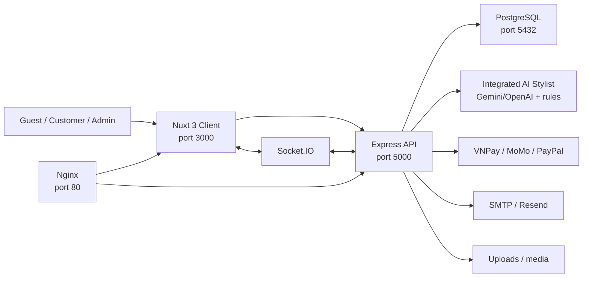
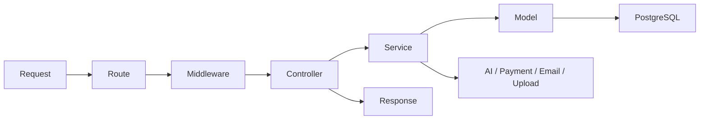
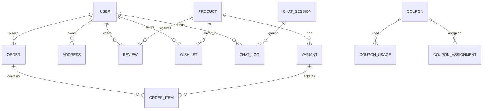
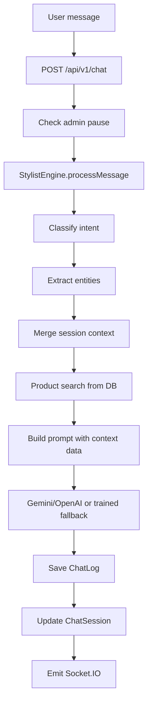
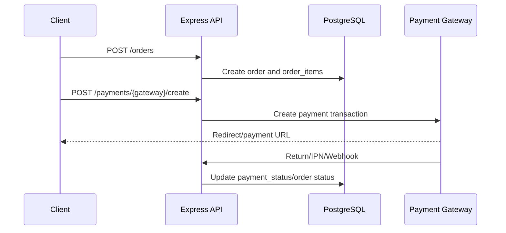

# AURA ARCHIVE - Phân tích dự án cập nhật

> Tên dự án: **AURA ARCHIVE**
> Loại dự án: **Full-stack e-commerce monorepo**
> Ngày cập nhật: **2026-05-06**
> Phạm vi phân tích: mã nguồn hiện tại trong repo `KLTN`
> Kết luận nhanh: dự án hiện là **Nuxt 3 client + Express.js server + PostgreSQL**, AI Stylist đã được hợp nhất vào backend Node.js, không còn service FastAPI/Python tách riêng.

---

## Mục lục

1. [Tóm tắt điều hành](#1-tóm-tắt-điều-hành)
2. [Kiến trúc tổng quan](#2-kiến-trúc-tổng-quan)
3. [Tech stack](#3-tech-stack)
4. [Cấu trúc repository](#4-cấu-trúc-repository)
5. [Frontend Nuxt 3](#5-frontend-nuxt-3)
6. [Backend Express.js](#6-backend-expressjs)
7. [Database và model](#7-database-và-model)
8. [API surface](#8-api-surface)
9. [AI Stylist tích hợp](#9-ai-stylist-tích-hợp)
10. [Realtime chat](#10-realtime-chat)
11. [Thanh toán](#11-thanh-toán)
12. [Security](#12-security)
13. [Deployment](#13-deployment)
14. [Điểm đã chỉnh so với tài liệu cũ](#14-điểm-đã-chỉnh-so-với-tài-liệu-cũ)
15. [Rủi ro và hướng phát triển](#15-rủi-ro-và-hướng-phát-triển)

---

## 1. Tóm tắt điều hành

`AURA ARCHIVE` là nền tảng thương mại điện tử thời trang cao cấp theo mô hình resale/consignment. Hệ thống có hai mặt chính:

- **Customer storefront:** duyệt sản phẩm, tìm kiếm/lọc, chi tiết sản phẩm, cart, checkout, payment, account, wishlist, review, blog, AI Stylist.
- **Admin portal:** dashboard, products/variants, orders, users, coupons, reviews, banners, blogs, popups, page builder, settings, AI config, chat sessions.

Điểm khác biệt của dự án nằm ở việc kết hợp e-commerce với AI Stylist. AI hiện không phải một service Python độc lập. Toàn bộ chat/voice AI được chạy trong backend Node.js, dùng:

- Gemini/OpenAI SDK khi có API key.
- Intent classifier, entity extraction, product search, session memory.
- Database product context để tránh giới thiệu sản phẩm không tồn tại.
- Socket.IO để đồng bộ chat realtime với admin.

---

## 2. Kiến trúc tổng quan



Luồng request:

1. User mở Nuxt client.
2. Client gọi `/api/v1` qua direct URL hoặc Nuxt/Nginx proxy.
3. Express xử lý route, middleware, controller, service.
4. Service truy cập PostgreSQL qua Sequelize hoặc gọi provider ngoài.
5. Socket.IO phát sự kiện chat/session cho customer/admin.
6. Nginx production proxy `/api`, `/uploads`, `/socket.io/` và frontend route.

---

## 3. Tech stack

### 3.1 Frontend

| Công nghệ | Version trong `client/package.json` | Vai trò |
|---|---:|---|
| Nuxt | `3.15.0` | Framework frontend |
| Vue | `^3.5.12` | UI layer |
| Tailwind CSS module | `^6.12.2` | Styling |
| Pinia | `^2.2.6` | State management |
| `@pinia-plugin-persistedstate/nuxt` | `^1.2.1` | Persist store |
| `@nuxtjs/i18n` | `8.2.0` | Song ngữ vi/en |
| Headless UI | `^1.7.22` | Accessible UI components |
| Heroicons | `^2.1.5` | Icon set |
| Chart.js / vue-chartjs | `^4.5.1` / `^5.3.3` | Admin charts |
| Socket.IO client | `^4.8.3` | Realtime chat |
| Pixi.js / pixi-live2d-display | `^6.5.10` / `^0.4.0` | Live2D mascot |
| Playwright | `^1.59.1` | Browser testing/tooling |
| Marked | `^17.0.4` | Markdown rendering |

### 3.2 Backend

| Công nghệ | Version trong `server/package.json` | Vai trò |
|---|---:|---|
| Express | `^4.21.1` | REST API |
| Sequelize | `^6.37.5` | ORM |
| PostgreSQL driver `pg` | `^8.13.1` | DB driver |
| Socket.IO | `^4.8.3` | Realtime |
| Swagger UI Express | `^5.0.1` | API docs |
| Helmet | `^8.0.0` | Security headers |
| CORS | `^2.8.5` | Origin control |
| express-rate-limit | `^7.4.1` | Rate limiting |
| bcryptjs | `^2.4.3` | Password hashing |
| jsonwebtoken | `^9.0.2` | JWT |
| multer | `^1.4.5-lts.1` | Upload |
| nodemailer | `^6.9.16` | Email |
| resend | `^6.9.4` | Email provider option |
| winston | `^3.15.0` | Logging |
| Google Generative AI SDK | `^0.24.1` | Gemini chat |
| `@google/genai` | `^1.46.0` | Gemini Live/GenAI |
| OpenAI SDK | `^6.32.0` | OpenAI fallback |
| PayPal/VNPay/MoMo logic | service nội bộ | Payment integrations |

### 3.3 Infrastructure

| Thành phần | Vai trò |
|---|---|
| Docker Compose | Chạy PostgreSQL, server, client, Nginx |
| Nginx Alpine | Reverse proxy |
| PostgreSQL 15 Alpine | Database container |
| `.env.example` | Mẫu cấu hình local |

---

## 4. Cấu trúc repository

```text
KLTN/
├── client/
│   ├── pages/                  # 54 page files: customer, auth, account, admin, payment
│   ├── components/             # UI, product, cart, AI, Live2D, admin
│   ├── composables/            # useApi, useAuth, useCart, useSocket, useLive2D...
│   ├── stores/                 # auth, cart, product, notification, user
│   ├── services/               # auth/product/order/user/chat API clients
│   ├── locales/                # en.json, vi.json
│   ├── middleware/             # auth/admin/guest route guards
│   └── nuxt.config.ts
├── server/
│   ├── server.js               # Express startup, docs, Socket.IO
│   └── src/
│       ├── routes/             # route index + v1 route files
│       ├── controllers/        # auth, product, order, payment, admin...
│       ├── services/           # business logic, AI, payment, upload
│       ├── services/ai/        # AI engine modules
│       ├── models/             # 23 Sequelize model files
│       ├── middlewares/        # auth/admin/error/upload/validate
│       ├── docs/               # OpenAPI builder
│       ├── socket.js
│       └── utils/
├── docker-compose.yml
├── nginx.conf
├── README.md
├── SRS.md
├── PROJECT_ANALYSIS.md
└── AURA_ARCHIVE_PPT_DETAILED.md
```

Không có thư mục `ai_service` trong workspace hiện tại. `.gitignore` cũng ghi nhận `ai_service/` là phần cũ đã merge vào server.

---

## 5. Frontend Nuxt 3

### 5.1 Nuxt config

`client/nuxt.config.ts` cấu hình:

- Modules: Tailwind CSS, Pinia, persisted state, i18n.
- i18n: `vi` mặc định, `en` hỗ trợ, lazy load từ `locales`.
- Runtime config public:
  - `apiUrl`
  - `socketUrl`
  - `imageBaseUrl`
- Nitro route rules:
  - `/api/**` proxy về backend.
  - `/uploads/**` proxy về backend.
  - `/socket.io` dev proxy về backend.
- TypeScript strict enabled, typeCheck disabled.
- Auto imports từ stores, composables, utils.

### 5.2 Route pages

Nhóm customer:

- `/`, `/about`, `/shop`, `/shop/[id]`
- `/featured`, `/new-arrivals`, `/sale`, `/compare`
- `/cart`, `/checkout`
- `/contact`, `/faqs`, `/shipping`, `/returns`, `/privacy`, `/terms`
- `/blog`, `/blog/[slug]`
- `/payment/success`, `/payment/failed`

Nhóm auth:

- `/auth/login`
- `/auth/register`
- `/auth/verify-otp`
- `/auth/forgot-password`
- `/auth/reset-password`

Nhóm account:

- `/account`
- `/account/profile`
- `/account/addresses`
- `/account/wishlist`
- `/account/orders`
- `/account/orders/[id]`

Nhóm admin:

- `/admin`, `/admin/dashboard`
- `/admin/products`, `/admin/products/create`, `/admin/products/new`, `/admin/products/[id]`
- `/admin/orders`, `/admin/orders/[id]`, `/admin/orders/[id]/print`
- `/admin/users`, `/admin/users/[id]`
- `/admin/coupons`, `/admin/reviews`, `/admin/banners`, `/admin/blogs`, `/admin/popups`
- `/admin/page-builder`, `/admin/ai-config`, `/admin/chats`
- `/admin/settings`, `/admin/settings/attributes`, `/admin/settings/payments`
- `/admin/abandoned-carts`

### 5.3 Component groups

Các component chính:

- AI: `AiChatWidget.vue`, `ChatBot.vue`, `VoiceChat.vue`, `Live2DMascot.vue`, `Live2DCanvasPreview.vue`, `Live2DSnapshot.vue`.
- Product: `ProductCard.vue`, `ProductFilter.vue`, `ProductGallery.vue`, `ProductReviews.vue`, `QuickView.vue`, `CompareBar.vue`, `RecentlyViewed.vue`, `RelatedProducts.vue`, `SizeGuide.vue`.
- Cart: `CartItem.vue`, `CartSummary.vue`.
- Admin: `AdminSidebar.vue`, `ImageUpload.vue`.
- Layout: `TheHeader.vue`, `TheFooter.vue`, `TheSidebar.vue`.
- Content: `BannerSlider.vue`, `DynamicBlockRenderer.vue`, `MarketingPopup.vue`.

### 5.4 State và composables

Stores:

- `auth.ts`
- `cart.ts`
- `cart.store.ts`
- `product.store.ts`
- `notification.store.ts`
- `user.store.ts`

Composables:

- API/auth: `useApi`, `useAuth`, `useAuthToken`
- Commerce: `useCart`, `useCompare`, `useCurrency`, `useRecentlyViewed`
- UX: `useNotification`, `useDialog`, `useNavigation`
- Media/content: `useImageUrl`, `usePageContent`, `useSiteSettings`
- AI/realtime: `useSocket`, `useLive2D`, `useAiCustomerContext`
- Security/display: `useSanitizeHtml`, `useProductSizeLabel`

### 5.5 Design system

Tailwind config định nghĩa:

- Fonts: Playfair Display, Inter.
- Colors: aura black/white/cream/ivory, neutral scale, accent gold/burgundy/navy/olive/tan.
- Shadows, spacing, animations, aspect ratios.
- Style định hướng luxury, nhiều whitespace, sản phẩm là trung tâm.

---

## 6. Backend Express.js

### 6.1 Startup flow

`server/server.js` làm các bước:

1. Load `.env`.
2. Tạo Express app.
3. Cấu hình Helmet.
4. Cấu hình CORS whitelist.
5. Cấu hình rate limit chung và auth limiter.
6. Parse JSON/urlencoded body.
7. Logging bằng Morgan.
8. Serve `/uploads` với cache headers.
9. Cung cấp `/health`.
10. Cung cấp OpenAPI JSON và Swagger UI nếu docs enabled.
11. Mount API routes tại `/api/v1`.
12. Kết nối PostgreSQL.
13. Sync database theo môi trường.
14. Seed default settings.
15. Tạo HTTP server, attach Socket.IO.
16. Graceful shutdown cho HTTP, Socket.IO và DB pool.

### 6.2 Pattern kiến trúc



Backend giữ pattern tương đối rõ:

- Routes khai báo endpoint và middleware.
- Controllers xử lý request/response.
- Services giữ business logic.
- Models mô tả dữ liệu Sequelize.
- Utils dùng chung cho error, token, logger, email, seeding.

### 6.3 Middleware

| Middleware | Vai trò |
|---|---|
| `auth.middleware.js` | `protect`, `optionalAuth` |
| `admin.middleware.js` | Kiểm tra role admin |
| `error.middleware.js` | `notFound`, `errorHandler` |
| `upload.middleware.js` | Multer upload config |
| `validate.middleware.js` | Express-validator result handling |

### 6.4 Route modules

Route aggregation ở `server/src/routes/index.js` mount các nhóm:

- `auth`
- `products`
- `orders`
- `admin`
- `chat`
- `wishlist`
- `users`
- `contact`
- `newsletter`
- `reviews`
- `coupons`
- `addresses`
- `banners`
- `popups`
- `locations`
- `payments`
- `abandoned-carts`
- `blogs`
- `shipping`
- `settings`
- `notifications`
- `page-content`
- `live2d`

---

## 7. Database và model

### 7.1 Model registry

`server/src/models/index.js` khởi tạo Sequelize và import các model:

- `User`
- `Product`
- `Variant`
- `Order`
- `OrderItem`
- `SystemPrompt`
- `ChatLog`
- `Wishlist`
- `Newsletter`
- `Review`
- `Coupon`
- `CouponUsage`
- `CouponAssignment`
- `Address`
- `Banner`
- `Blog`
- `SiteSettings`
- `Popup`
- `AbandonedCart`
- `ChatSession`
- `Notification`
- `PageContent`

### 7.2 ERD rút gọn



### 7.3 Điểm thiết kế quan trọng

- `Product` chứa thông tin chung: name, slug, brand, category, price, images, tags, condition.
- `Variant` đại diện item cụ thể trong resale: SKU, size, color, material, status, stock.
- `OrderItem` lưu snapshot product name, brand, size, color, price tại thời điểm mua.
- `SystemPrompt` lưu prompt/appearance/voice config để admin chỉnh trong DB.
- `PageContent` lưu blocks để làm page builder.
- `SiteSettings` lưu cấu hình site, SEO, payment methods, product attributes.

### 7.4 Index/ràng buộc đáng chú ý

- Unique email ở users.
- Unique slug ở products.
- Unique SKU ở variants.
- Unique order number ở orders.
- Unique user-product ở wishlist.
- Unique user-product review.
- Index theo status/payment_status/created_at cho order.
- Index theo category/brand/is_active cho product.

---

## 8. API surface

### 8.1 Public/customer API

| Nhóm | Endpoint tiêu biểu |
|---|---|
| Auth | `POST /auth/register`, `POST /auth/login`, `GET /auth/me` |
| Products | `GET /products`, `GET /products/featured`, `GET /products/:id` |
| Orders | `POST /orders`, `GET /orders`, `POST /orders/check-availability` |
| Payments | `POST /payments/vnpay/create`, `POST /payments/momo/create`, `POST /payments/paypal/create` |
| Wishlist | `GET /wishlist`, `POST /wishlist`, `DELETE /wishlist/:productId` |
| Reviews | `GET /products/:productId/reviews`, `POST /products/:productId/reviews` |
| Chat | `POST /chat`, `GET /chat/greeting`, `GET /chat/history/:sessionId` |
| Voice | `GET /chat/voice-token`, `POST /chat/voice-tool-call`, `POST /chat/voice-sync` |
| Content | `GET /blogs`, `GET /banners`, `GET /popups`, `GET /page-content/:pageKey` |
| Settings | `GET /settings`, `GET /settings/product-attributes` |

### 8.2 Admin API

| Nhóm | Endpoint tiêu biểu |
|---|---|
| Dashboard | `GET /admin/stats`, `GET /admin/revenue/monthly` |
| Orders | `GET /admin/orders`, `PATCH /admin/orders/:id/status` |
| Products | `GET /admin/products`, `POST /admin/products`, `PUT /admin/products/:id` |
| Variants | `GET /admin/products/:productId/variants`, `PATCH /admin/variants/:id/status` |
| Users | `GET /admin/users`, `PATCH /admin/users/:id/status` |
| Reviews | `GET /admin/reviews`, `PATCH /admin/reviews/:reviewId/moderate` |
| Coupons | `GET /admin/coupons`, `POST /admin/coupons`, `GET /admin/coupons/:id/stats` |
| Content | `GET /admin/banners`, `GET /admin/blogs`, `GET /admin/popups` |
| Settings | `GET /admin/settings`, `PUT /admin/settings`, `GET /admin/product-attributes` |
| AI | `GET /admin/system-prompts`, `PUT /admin/system-prompts/:key`, `POST /admin/voice-preview` |
| Chat admin | `GET /admin/chats`, `PATCH /admin/chats/:sessionId/pause-ai`, `POST /admin/chats/:sessionId/message` |
| Upload | `POST /admin/upload/product-images`, `POST /admin/upload/avatar`, `POST /admin/upload/banner` |
| Page content | `GET /admin/page-content/:pageKey`, `PUT /admin/page-content/:pageKey`, publish/unpublish/translate |

### 8.3 API docs

Backend generate docs tại:

- `/docs`
- `/openapi.json`

`API_DOCS_MODE` điều khiển scope:

- `full`: hiển thị cả protected/admin routes.
- `public`: chỉ public/demo-safe routes.
- `off`: tắt docs.

---

## 9. AI Stylist tích hợp

### 9.1 Vị trí code

AI hiện nằm trong backend:

```text
server/src/services/ai.service.js
server/src/services/ai/
├── intent-classifier.js
├── knowledge-base.js
├── product-search.js
├── session-memory.js
└── stylist-engine.js
server/src/services/voice.service.js
```

### 9.2 Chat flow



### 9.3 Behavior

Stylist engine:

- Phân loại intent như product search, category browse, price inquiry, style advice, inventory check.
- Trích xuất entity như brand, category, color, budget, size.
- Tìm sản phẩm thật trong database.
- Không tự bịa sản phẩm nếu context không có.
- Có session memory để nối mạch hội thoại.
- Có model fallback chain cho Gemini.
- Có OpenAI client nếu cấu hình `OPENAI_API_KEY`.
- Có `CHATBOT_MODE` để điều khiển behavior.

### 9.4 Voice AI

`voice.service.js` xử lý:

- Voice config từ `VOICE_CONFIG` trong `SystemPrompt`.
- Gemini Live model config.
- Voice preview qua Gemini TTS.
- Browser-playable WAV wrapping khi provider trả PCM.
- Tool declarations cho voice tool calling.
- Tool execution: search products, navigate product, add cart, wishlist, checkout, Live2D gesture.
- Transcript sync vào chat memory và database.
- Live2D model URL validation và fallback.

---

## 10. Realtime chat

`server/src/socket.js` dùng Socket.IO:

- Client join room theo `session:{sessionId}`.
- Admin join `admin-room`.
- `emitNewMessage(sessionId, message)` gửi cho room session và admin room.
- `emitSessionUpdate(session)` gửi cập nhật session cho admin room.
- CORS kiểm tra origin theo `CLIENT_URL`, `ALLOWED_ORIGINS`, và domain Vercel.

Realtime được dùng để:

- Customer nhận tin nhắn mới.
- Admin thấy chat activity mới.
- Admin tham gia session khi AI bị pause.

---

## 11. Thanh toán

### 11.1 Payment methods

Backend hỗ trợ:

- VNPay
- MoMo
- PayPal
- COD/bank transfer/credit card qua cấu hình order/payment method

### 11.2 Luồng tổng quát



### 11.3 Rủi ro production

- Callback URL phải là public HTTPS.
- Webhook/IPN cần verify signature đầy đủ.
- Payment update nên idempotent để tránh callback lặp.
- Không đưa payment secret ra client.

---

## 12. Security

Backend đã có các lớp bảo vệ chính:

- Helmet security headers.
- CORS whitelist.
- General API rate limit.
- Strict auth rate limit cho login/register/forgot/reset.
- JWT middleware.
- Admin role middleware.
- express-validator.
- bcrypt password hashing.
- Multer upload middleware.
- Global error handler.

Điểm cần tiếp tục gia cố:

- Secret management cho production.
- Audit webhook/IPN signature.
- Automated security tests.
- File upload content-type/size policy rõ hơn trong tài liệu vận hành.
- Monitoring failed auth/payment events.

---

## 13. Deployment

### 13.1 Docker Compose

Services hiện có:

| Service | Vai trò | Port |
|---|---|---:|
| `postgres` | PostgreSQL 15 Alpine | 5432 |
| `server` | Production Node API | expose 5000 |
| `client` | Production Nuxt client | expose 3000 |
| `nginx` | Reverse proxy | 80 |
| `server-dev` | Development API hot reload | 5000 |
| `client-dev` | Development client hot reload | 3000 |

Không có service `ai-service`.

### 13.2 Nginx

Nginx nên proxy:

- `/api` -> backend API.
- `/uploads` -> backend static uploads.
- `/socket.io/` -> backend Socket.IO.
- `/` -> Nuxt client.

Vì AI đã nằm trong backend và route AI hiện đi qua `/api/v1/chat`, Nginx không cần upstream `/ai`.

### 13.3 Local dev

Khởi động DB:

```bash
docker-compose up postgres -d
```

Backend:

```bash
cd server
npm install
npm run dev
```

Frontend:

```bash
cd client
npm install
npm run dev
```

---

## 14. Điểm đã chỉnh so với tài liệu cũ

Tài liệu cũ mô tả kiến trúc gồm `Client + Server + AI Service FastAPI`. Điều này không còn đúng với repo hiện tại.

Đã cập nhật:

- README: bỏ hướng dẫn Python/FastAPI/uvicorn, cập nhật quick start chỉ cần client/server/PostgreSQL.
- SRS: nâng version lên `1.1`, cập nhật route, actor, dữ liệu, AI tích hợp.
- PROJECT_ANALYSIS: thay toàn bộ phần FastAPI bằng phân tích AI tích hợp Node.js.
- CONTRIBUTING: bỏ bước cài/chạy `ai_service`.
- `client/.env.example`: bỏ `NUXT_PUBLIC_AI_SERVICE_URL`.
- `nginx.conf`: bỏ upstream/location `/ai` trỏ tới service không tồn tại.

---

## 15. Rủi ro và hướng phát triển

### 15.1 Rủi ro hiện tại

- Thiếu automated tests rõ ràng cho business-critical flows.
- Payment callback cần kiểm thử thực tế với public HTTPS.
- Voice AI phụ thuộc model/key của Gemini.
- `setup-project.ps1` là scaffold cũ, không phản ánh kiến trúc hiện tại.
- Một số artifact thuyết trình cũ có thể còn mô tả FastAPI nếu không được dùng từ tài liệu mới.

### 15.2 Hướng phát triển

- Thêm test unit/integration cho auth, order, payment, AI search.
- Thêm e2e checkout/admin flows bằng Playwright.
- Thêm CI/CD pipeline.
- Thêm seller portal cho ký gửi.
- Thêm recommendation engine dựa trên viewed/wishlist/order.
- Tách reporting/analytics chuyên sâu.
- Tăng observability: logs, metrics, error tracking, uptime.
- Chuẩn hóa production docs: deployment, backup, restore, payment verification.

---

## 16. File đã đối chiếu

- `README.md`
- `SRS.md`
- `PROJECT_ANALYSIS.md`
- `CONTRIBUTING.md`
- `client/package.json`
- `client/nuxt.config.ts`
- `client/.env.example`
- `client/pages/*`
- `client/components/*`
- `client/composables/*`
- `client/stores/*`
- `server/package.json`
- `server/server.js`
- `server/.env.example`
- `server/src/routes/index.js`
- `server/src/routes/v1/*`
- `server/src/models/*`
- `server/src/services/ai.service.js`
- `server/src/services/ai/*`
- `server/src/services/voice.service.js`
- `server/src/socket.js`
- `docker-compose.yml`
- `nginx.conf`
