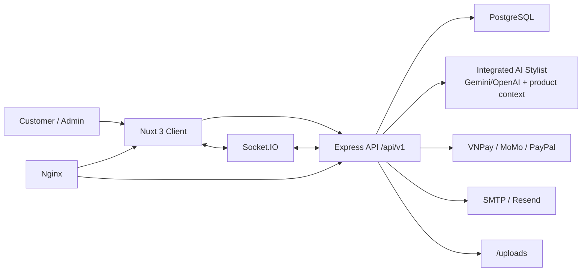

# AURA ARCHIVE

> Luxury Resell & Consignment Fashion E-commerce Platform with an integrated AI Stylist.

`AURA ARCHIVE` là một monorepo full-stack cho nền tảng thương mại điện tử thời trang cao cấp theo mô hình resale/consignment. Dự án gồm frontend Nuxt 3, backend Express.js, PostgreSQL, Socket.IO realtime chat, thanh toán VNPay/MoMo/PayPal và AI Stylist tích hợp trực tiếp trong backend Node.js.

> Cập nhật tài liệu: **2026-05-06**
> Trạng thái kiến trúc hiện tại: **Client + Server + PostgreSQL**, không còn service FastAPI/Python tách riêng trong repo.

---

## Tech Stack

| Thành phần | Công nghệ | Port mặc định | Ghi chú |
|---|---|---:|---|
| Client | Nuxt 3, Vue 3, Tailwind CSS, Pinia, i18n | 3000 | Giao diện customer/admin |
| Server API | Express.js, Sequelize, Socket.IO, Swagger UI | 5000 | REST API, AI, payment, realtime |
| Database | PostgreSQL 15 Alpine qua Docker | 5432 | Lưu users, products, orders, chat, settings |
| Reverse proxy | Nginx | 80 | Proxy client, API, uploads, Socket.IO |
| AI Stylist | Gemini/OpenAI SDK trong backend Node.js | 5000 | Không cần chạy FastAPI riêng |

---

## Kiến trúc hiện tại



Luồng chính:

1. Người dùng truy cập Nuxt client.
2. Client gọi REST API qua `/api/v1`.
3. Backend xử lý nghiệp vụ, truy cập PostgreSQL bằng Sequelize.
4. AI Stylist chạy trong backend, lấy context sản phẩm từ database rồi gọi Gemini/OpenAI nếu có API key.
5. Socket.IO đồng bộ chat realtime giữa khách hàng và admin.
6. Nginx proxy `/api`, `/uploads`, `/socket.io/` và route frontend.

---

## Cấu trúc thư mục

```text
KLTN/
├── client/                         # Frontend Nuxt 3
│   ├── app.vue
│   ├── nuxt.config.ts
│   ├── tailwind.config.js
│   ├── pages/                      # Customer, auth, admin, payment routes
│   ├── components/                 # UI components, AI widgets, product/cart/admin
│   ├── composables/                # useApi, useAuth, useCart, useSocket, useLive2D...
│   ├── stores/                     # Pinia stores
│   ├── services/                   # API client wrappers
│   ├── locales/                    # en.json, vi.json
│   └── assets/
├── server/                         # Backend Express.js
│   ├── server.js                   # Server entry point
│   ├── package.json
│   ├── uploads/                    # Uploaded assets
│   └── src/
│       ├── routes/                 # API route aggregation and v1 routes
│       ├── controllers/            # HTTP request handlers
│       ├── services/               # Business logic, AI, payment, upload, email
│       ├── services/ai/            # Intent classifier, product search, session memory
│       ├── models/                 # Sequelize models and associations
│       ├── middlewares/            # Auth, admin, validation, upload, errors
│       ├── docs/                   # OpenAPI spec builder
│       ├── socket.js               # Socket.IO integration
│       └── utils/                  # Logger, token, seeder, email helpers
├── docker-compose.yml
├── nginx.conf
├── README.md
├── SRS.md
├── PROJECT_ANALYSIS.md
└── AURA_ARCHIVE_PPT_DETAILED.md
```

---

## Yêu cầu hệ thống

- Node.js 18+
- npm 9+
- Docker Desktop nếu muốn chạy PostgreSQL/Nginx bằng Docker
- PostgreSQL 14+ nếu không dùng Docker
- Git

Không cần Python/FastAPI cho kiến trúc hiện tại.

---

## Quick Start local

### 1. Clone project

```bash
git clone git@github.com:Anhvu1107/KLTN.git
cd KLTN
```

### 2. Khởi động PostgreSQL bằng Docker

```bash
docker-compose up postgres -d
```

Database mặc định:

| Key | Value |
|---|---|
| Host | `localhost` |
| Port | `5432` |
| Database | `aura_archive` |
| User | `postgres` |
| Password | `aura_secret_2024` nếu không override `DB_PASSWORD` |

Kiểm tra database:

```bash
docker exec -it aura-postgres psql -U postgres -d aura_archive -c "SELECT 1;"
```

### 3. Cấu hình server

```bash
cd server
copy .env.example .env
npm install
```

Các biến quan trọng trong `server/.env`:

| Biến | Mục đích |
|---|---|
| `PORT` | Port backend, mặc định `5000` |
| `CLIENT_URL` | Origin frontend cho CORS |
| `DB_HOST`, `DB_PORT`, `DB_NAME`, `DB_USER`, `DB_PASSWORD` | Kết nối PostgreSQL |
| `JWT_SECRET`, `JWT_EXPIRES_IN` | Xác thực JWT |
| `GEMINI_API_KEY`, `GEMINI_MODEL`, `GEMINI_LIVE_MODEL` | AI chat/voice qua Gemini |
| `OPENAI_API_KEY`, `OPENAI_MODEL` | AI fallback/alternative |
| `CHATBOT_MODE` | `auto` hoặc trained-only behavior |
| `API_DOCS_MODE` | `full`, `public`, hoặc `off` |
| `MOMO_*`, `VNPAY_*`, `PAYPAL_*` | Thanh toán |
| `SMTP_*`, `RESEND_*` | Email |

### 4. Cấu hình client

```bash
cd ../client
copy .env.example .env
npm install
```

`client/.env` local thường dùng:

```env
NUXT_PUBLIC_API_URL=http://localhost:5000/api/v1
NUXT_PUBLIC_SOCKET_URL=http://localhost:5000
NUXT_PUBLIC_IMAGE_BASE_URL=http://localhost:5000
```

### 5. Seed database

```bash
cd ../server
npm run seed
```

Tài khoản demo:

| Role | Email | Password |
|---|---|---|
| Admin | `admin@aura.com` | `admin123` |
| Customer | `customer@aura.com` | `123456` |

### 6. Chạy development

Terminal server:

```bash
cd server
npm run dev
```

Terminal client:

```bash
cd client
npm run dev
```

URL chính:

| Mục | URL |
|---|---|
| Frontend | `http://localhost:3000` |
| Backend API | `http://localhost:5000/api/v1` |
| API docs | `http://localhost:5000/docs` |
| OpenAPI JSON | `http://localhost:5000/openapi.json` |
| Health | `http://localhost:5000/health` |

---

## Chạy bằng Docker Compose

Development containers:

```bash
docker-compose up postgres server-dev client-dev
```

Production-like stack:

```bash
docker-compose up postgres server client nginx
```

Sau khi chạy production-like stack, truy cập:

- Frontend qua Nginx: `http://localhost`
- API qua Nginx: `http://localhost/api/v1`
- Uploads qua Nginx: `http://localhost/uploads`
- Socket.IO qua Nginx: `http://localhost/socket.io/`

---

## Tính năng chính

### Customer

- Homepage, shop, featured, new arrivals, sale.
- Product detail với gallery, variants, reviews, related products.
- Tìm kiếm, lọc sản phẩm, so sánh sản phẩm, recently viewed.
- Đăng ký, OTP verification, đăng nhập, OAuth Google/Facebook, quên mật khẩu.
- Profile, địa chỉ giao hàng, wishlist, lịch sử đơn hàng.
- Cart, coupon, shipping, checkout.
- Thanh toán VNPay, MoMo, PayPal và các phương thức được cấu hình.
- Blog, banner, popup, page content động.
- AI Stylist chat, voice assistant và Live2D mascot.

### Admin

- Dashboard thống kê và doanh thu theo tháng.
- Quản lý sản phẩm và variants.
- Quản lý đơn hàng, trạng thái đơn, trạng thái thanh toán, in đơn.
- Quản lý người dùng.
- Quản lý reviews, coupons, banners, blogs, popups.
- Page builder/page content.
- Site settings, payment settings, product attributes.
- AI prompt/config, chat appearance, voice preview/config.
- Quản lý chat sessions: read/unread, pause AI, admin join, gửi tin nhắn, close/reopen.
- Notifications và abandoned carts.

---

## AI Stylist

AI Stylist không còn là service Python tách riêng. Logic AI hiện nằm trong backend:

- `server/src/services/ai.service.js`
- `server/src/services/ai/stylist-engine.js`
- `server/src/services/ai/intent-classifier.js`
- `server/src/services/ai/product-search.js`
- `server/src/services/ai/session-memory.js`
- `server/src/services/voice.service.js`

Luồng chat:

1. Client gọi `POST /api/v1/chat`.
2. Backend kiểm tra session có bị admin pause AI hay không.
3. Stylist engine phân loại intent và trích xuất entity.
4. Backend tìm sản phẩm thật trong database để tạo context.
5. Nếu có Gemini/OpenAI API key, model sinh câu trả lời dựa trên context; nếu không, engine fallback về trained response.
6. Chat log và session metadata được lưu vào database.
7. Socket.IO emit tin nhắn cho client và admin room.

Voice AI dùng Gemini Live config qua:

- `GET /api/v1/chat/voice-token`
- `GET /api/v1/chat/voice-settings`
- `POST /api/v1/chat/voice-tool-call`
- `POST /api/v1/chat/voice-sync`
- `POST /api/v1/admin/voice-preview`

---

## API surface

| Nhóm | Base path | Mô tả |
|---|---|---|
| Auth | `/api/v1/auth` | Register, OTP, login, OAuth, password reset |
| Products | `/api/v1/products` | Catalog, detail, featured, sale, related, inventory |
| Orders | `/api/v1/orders` | Create order, check availability, my orders, cancel |
| Payments | `/api/v1/payments` | VNPay, MoMo, PayPal create/return/IPN/webhook |
| Wishlist | `/api/v1/wishlist` | Add/remove/check wishlist |
| Reviews | `/api/v1/products/:productId/reviews` | Product reviews and rating summary |
| Coupons | `/api/v1/coupons` | Public coupons, validate, my coupons |
| Chat | `/api/v1/chat` | AI chat, greeting, history, appearance, voice |
| Admin | `/api/v1/admin` | Admin dashboard, CRUD, settings, chat, upload |
| Content | `/api/v1/blogs`, `/banners`, `/popups`, `/page-content` | Public marketing/content |
| Settings | `/api/v1/settings` | Public settings and product attributes |
| Notifications | `/api/v1/notifications` | User/admin notifications |

API docs được generate tại `/docs` và `/openapi.json`.

---

## Database overview

Các Sequelize model hiện có:

- Users and account: `User`, `Address`, `Notification`
- Product catalog: `Product`, `Variant`, `Review`, `Wishlist`
- Order/payment: `Order`, `OrderItem`
- Coupon: `Coupon`, `CouponUsage`, `CouponAssignment`
- AI/chat: `SystemPrompt`, `ChatLog`, `ChatSession`
- Content/settings: `Banner`, `Blog`, `Popup`, `PageContent`, `SiteSettings`, `Newsletter`
- Operations: `AbandonedCart`

Điểm quan trọng của resale logic: `Variant` đại diện cho item cụ thể theo SKU/size/color/material/status. `OrderItem` lưu snapshot tên sản phẩm, brand, variant và giá tại thời điểm mua để bảo toàn lịch sử đơn hàng.

---

## Scripts

### Root

Root `package.json` hiện chỉ có dependency hỗ trợ tooling (`puppeteer`). Development chính chạy trong `client` và `server`.

### Client

```bash
npm run dev
npm run build
npm run generate
npm run preview
npm run lint
npm run lint:fix
```

### Server

```bash
npm run dev
npm start
npm run seed
npm run db:migrate
npm run db:seed
npm run db:reset
npm run lint
npm run lint:fix
```

---

## Design system

- Typography: Playfair Display cho heading, Inter cho body.
- Colors:
  - Black `#0A0A0A`
  - White `#FFFFFF`
  - Cream `#FAF9F6`
  - Gold `#D4AF37`
  - Burgundy `#722F37`
  - Navy `#041E42`
- Style: luxury, editorial, refined whitespace, product-first layout.
- i18n: Vietnamese default, English supported.

---

## Tài liệu dự án

- [SRS.md](SRS.md): đặc tả yêu cầu phần mềm.
- [PROJECT_ANALYSIS.md](PROJECT_ANALYSIS.md): phân tích kiến trúc, module, API, database và rủi ro.
- [AURA_ARCHIVE_PPT_DETAILED.md](AURA_ARCHIVE_PPT_DETAILED.md): nội dung chi tiết để làm PPTX.
- [CONTRIBUTING.md](CONTRIBUTING.md): hướng dẫn setup và workflow đóng góp.

---

## Ghi chú hiện trạng

- Không còn cần chạy `ai_service`, `uvicorn`, FastAPI hoặc LangChain riêng.
- `client/.env.example` không còn dùng `NUXT_PUBLIC_AI_SERVICE_URL`.
- Nginx production chỉ proxy client, API, uploads và Socket.IO.
- Một số file cũ như `setup-project.ps1` là script scaffold ban đầu, không nên coi là nguồn sự thật cho kiến trúc hiện tại.

---

## Liên hệ

- GitHub: [@Anhvu1107](https://github.com/Anhvu1107)
