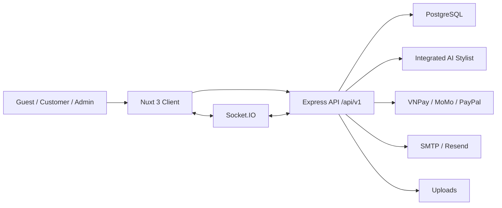

# Software Requirements Specification (SRS)

## Dự án: AURA ARCHIVE

- Phiên bản tài liệu: `1.1`
- Ngày cập nhật: `2026-05-06`
- Trạng thái: `Synced with current source`
- Phạm vi: bám theo mã nguồn hiện có trong repo `KLTN`
- Kiến trúc hiện tại: Nuxt 3 frontend, Express.js backend, PostgreSQL, AI Stylist tích hợp trong backend Node.js

---

## 1. Giới thiệu

### 1.1 Mục đích

Tài liệu này mô tả đặc tả yêu cầu phần mềm cho `AURA ARCHIVE`, một nền tảng thương mại điện tử thời trang cao cấp theo mô hình resale/consignment. SRS dùng để:

- Làm rõ phạm vi, actor, chức năng và ràng buộc của hệ thống.
- Đồng bộ tài liệu với mã nguồn thực tế.
- Làm cơ sở cho kiểm thử, bảo trì, báo cáo khóa luận và thuyết trình.
- Ghi nhận các điểm đã triển khai và các giới hạn hiện tại.

### 1.2 Phạm vi hệ thống

Hệ thống cho phép:

- Khách truy cập duyệt sản phẩm, tìm kiếm, lọc, xem chi tiết, xem blog và tương tác với AI Stylist.
- Khách hàng đăng ký, xác thực OTP, đăng nhập, quản lý hồ sơ, địa chỉ, wishlist, giỏ hàng và đơn hàng.
- Khách hàng checkout, áp dụng coupon, tính phí vận chuyển và thanh toán trực tuyến.
- Admin quản lý sản phẩm, variants, đơn hàng, người dùng, review, coupon, banner, blog, popup, page content, settings, AI config và chat sessions.
- Backend cung cấp REST API, Socket.IO realtime chat, OpenAPI docs, payment integrations và AI Stylist tích hợp.

### 1.3 Ngoài phạm vi hiện tại

- Mobile app native.
- Hệ thống ERP/CRM độc lập.
- Seller portal cho người ký gửi.
- Hệ thống kho đa chi nhánh phức tạp.
- AI service FastAPI/Python tách riêng. Kiến trúc hiện tại đã hợp nhất AI vào backend Node.js.

### 1.4 Đối tượng sử dụng tài liệu

- Giảng viên hướng dẫn và hội đồng bảo vệ.
- Nhóm phát triển frontend/backend.
- Người kiểm thử.
- Người vận hành/admin.
- Người tiếp tục bảo trì hoặc mở rộng dự án.

### 1.5 Tài liệu tham chiếu

- [README.md](README.md)
- [PROJECT_ANALYSIS.md](PROJECT_ANALYSIS.md)
- [AURA_ARCHIVE_PPT_DETAILED.md](AURA_ARCHIVE_PPT_DETAILED.md)
- [client/package.json](client/package.json)
- [client/nuxt.config.ts](client/nuxt.config.ts)
- [server/package.json](server/package.json)
- [server/server.js](server/server.js)
- [docker-compose.yml](docker-compose.yml)
- [nginx.conf](nginx.conf)

### 1.6 Thuật ngữ

| Thuật ngữ | Giải thích |
|---|---|
| Guest | Người dùng chưa đăng nhập |
| Customer | Người dùng đã đăng ký tài khoản |
| Admin | Người quản trị hệ thống |
| SKU | Mã định danh biến thể/item |
| Variant | Biến thể hoặc item vật lý cụ thể của sản phẩm |
| Resale/Consignment | Mô hình bán lại hoặc ký gửi hàng đã qua sử dụng |
| JWT | JSON Web Token |
| OTP | One-Time Password |
| AI Stylist | Trợ lý AI tư vấn thời trang/sản phẩm |
| IPN/Webhook | Callback bất đồng bộ từ cổng thanh toán |
| SSR | Server-side rendering |

---

## 2. Mô tả tổng quan

### 2.1 Bối cảnh sản phẩm

`AURA ARCHIVE` là nền tảng e-commerce dành cho thời trang cao cấp đã qua sử dụng. Khác với bán lẻ phổ thông, người mua cần nhiều thông tin hơn về thương hiệu, tình trạng sản phẩm, độ chính hãng, kích cỡ, màu sắc, chất liệu và khả năng phối đồ. Vì vậy hệ thống kết hợp catalog sản phẩm, quy trình mua hàng đầy đủ và AI Stylist để hỗ trợ quyết định mua.

### 2.2 Kiến trúc tổng thể

Thành phần:

- **Frontend:** Nuxt 3, Vue 3, Tailwind CSS, Pinia, i18n.
- **Backend:** Express.js, Sequelize, Socket.IO, Swagger/OpenAPI.
- **Database:** PostgreSQL.
- **AI:** Gemini/OpenAI SDK, intent classifier, product search, session memory trong backend.
- **Payment:** VNPay, MoMo, PayPal.
- **Deployment:** Docker Compose và Nginx reverse proxy.

### 2.3 Actor

| Actor | Mô tả | Quyền chính |
|---|---|---|
| Guest | Khách chưa đăng nhập | Duyệt sản phẩm, tìm kiếm, xem blog, chat AI, đăng ký/đăng nhập |
| Customer | Người dùng đã đăng nhập | Mua hàng, wishlist, review, quản lý tài khoản, đơn hàng |
| Admin | Quản trị viên | Quản lý dữ liệu, nội dung, đơn hàng, AI, chat, settings |
| Payment Gateway | VNPay/MoMo/PayPal | Xử lý giao dịch và callback |
| OAuth Provider | Google/Facebook | Xác thực OAuth |
| Email Service | SMTP/Resend | Gửi OTP, reset password, notification |
| AI Provider | Gemini/OpenAI | Sinh phản hồi tư vấn chat/voice |

### 2.4 Ràng buộc triển khai

- Frontend chạy bằng Node.js/Nuxt.
- Backend chạy bằng Node.js/Express.
- Database yêu cầu PostgreSQL.
- Các tính năng AI, OAuth, email và payment yêu cầu biến môi trường tương ứng.
- Voice chat yêu cầu trình duyệt hỗ trợ microphone và người dùng cấp quyền.
- Payment callback thực tế cần public HTTPS URL.

### 2.5 Giả định

- Người dùng sử dụng trình duyệt hiện đại có JavaScript.
- Admin có tài khoản role `ADMIN`.
- Database đã được seed hoặc có dữ liệu tối thiểu.
- Product images và Live2D assets được phục vụ qua `/uploads` hoặc public assets hợp lệ.

---

## 3. Yêu cầu chức năng

### 3.1 FR-01: Tài khoản và xác thực

Hệ thống phải cho phép:

- Đăng ký tài khoản bằng email/password.
- Gửi OTP xác thực tài khoản.
- Xác thực OTP.
- Gửi lại OTP.
- Đăng nhập bằng email/password.
- Đăng nhập bằng Google.
- Đăng nhập bằng Facebook.
- Lấy thông tin người dùng hiện tại.
- Quên mật khẩu.
- Reset mật khẩu.
- Đổi mật khẩu khi đã đăng nhập.
- Từ chối đăng nhập với user bị vô hiệu hóa.

Endpoint liên quan:

- `POST /api/v1/auth/register`
- `POST /api/v1/auth/verify-otp`
- `POST /api/v1/auth/resend-otp`
- `POST /api/v1/auth/login`
- `POST /api/v1/auth/google`
- `POST /api/v1/auth/facebook`
- `GET /api/v1/auth/me`
- `POST /api/v1/auth/forgot-password`
- `POST /api/v1/auth/reset-password`
- `POST /api/v1/auth/change-password`

### 3.2 FR-02: Hồ sơ người dùng

Customer phải có thể:

- Xem profile.
- Cập nhật thông tin cá nhân.
- Đổi mật khẩu.
- Xem lịch sử đơn hàng.
- Xem chi tiết từng đơn hàng.

Endpoint:

- `GET /api/v1/users/profile`
- `PUT /api/v1/users/profile`
- `PUT /api/v1/users/password`
- `GET /api/v1/users/orders`
- `GET /api/v1/users/orders/:id`

### 3.3 FR-03: Địa chỉ giao hàng

Customer phải có thể:

- Xem danh sách địa chỉ.
- Xem địa chỉ mặc định.
- Xem chi tiết địa chỉ.
- Tạo địa chỉ mới.
- Cập nhật địa chỉ.
- Xóa địa chỉ.
- Đặt địa chỉ mặc định.

Endpoint:

- `GET /api/v1/addresses`
- `GET /api/v1/addresses/default`
- `GET /api/v1/addresses/:id`
- `POST /api/v1/addresses`
- `PUT /api/v1/addresses/:id`
- `DELETE /api/v1/addresses/:id`
- `PATCH /api/v1/addresses/:id/default`

### 3.4 FR-04: Catalog sản phẩm

Hệ thống phải hỗ trợ:

- Xem danh sách sản phẩm.
- Xem sản phẩm nổi bật.
- Xem sản phẩm mới về.
- Xem sản phẩm bán chạy.
- Xem sản phẩm sale.
- Xem danh mục.
- Xem thương hiệu.
- Xem tổng quan tồn kho.
- Xem chi tiết sản phẩm theo id/slug.
- Xem sản phẩm liên quan.
- Lọc và tìm kiếm trên shop page.
- So sánh sản phẩm ở frontend.
- Recently viewed ở frontend.

Endpoint:

- `GET /api/v1/products`
- `GET /api/v1/products/featured`
- `GET /api/v1/products/new-arrivals`
- `GET /api/v1/products/best-sellers`
- `GET /api/v1/products/sale`
- `GET /api/v1/products/categories`
- `GET /api/v1/products/brands`
- `GET /api/v1/products/inventory-summary`
- `GET /api/v1/products/:id`
- `GET /api/v1/products/:id/related`

### 3.5 FR-05: Giỏ hàng, checkout và đơn hàng

Hệ thống phải cho phép:

- Thêm/xóa/cập nhật sản phẩm trong giỏ ở frontend.
- Kiểm tra availability trước khi tạo đơn.
- Tạo đơn hàng.
- Lưu snapshot product/variant trong `order_items`.
- Tính subtotal, shipping, discount, total.
- Xem danh sách đơn của customer.
- Xem chi tiết đơn.
- Hủy đơn theo điều kiện trạng thái.
- Cập nhật phương thức thanh toán nếu luồng thanh toán yêu cầu.

Endpoint:

- `POST /api/v1/orders`
- `GET /api/v1/orders`
- `POST /api/v1/orders/check-availability`
- `GET /api/v1/orders/:id`
- `POST /api/v1/orders/:id/cancel`
- `PATCH /api/v1/orders/:id/payment-method`

### 3.6 FR-06: Thanh toán

Hệ thống phải hỗ trợ:

- VNPay payment creation.
- VNPay return.
- VNPay IPN.
- MoMo payment creation.
- MoMo return.
- MoMo IPN.
- PayPal payment creation.
- PayPal return.
- PayPal cancel.
- PayPal webhook.

Endpoint:

- `POST /api/v1/payments/vnpay/create`
- `GET /api/v1/payments/vnpay/return`
- `GET /api/v1/payments/vnpay/ipn`
- `POST /api/v1/payments/momo/create`
- `GET /api/v1/payments/momo/return`
- `POST /api/v1/payments/momo/ipn`
- `POST /api/v1/payments/paypal/create`
- `GET /api/v1/payments/paypal/return`
- `GET /api/v1/payments/paypal/cancel`
- `POST /api/v1/payments/paypal/webhook`

### 3.7 FR-07: Coupon

Hệ thống phải hỗ trợ:

- Xem coupon public.
- Validate coupon cho giỏ hàng/đơn hàng.
- Xem coupon được gán cho customer.
- Admin CRUD coupon.
- Admin xem thống kê coupon.
- Coupon hỗ trợ `PERCENTAGE`, `FIXED_AMOUNT`, `FREE_SHIPPING`.
- Coupon hỗ trợ visibility `PUBLIC`, `PRIVATE`, `PERSONAL`.

Endpoint public/customer:

- `GET /api/v1/coupons/public`
- `POST /api/v1/coupons/validate`
- `GET /api/v1/coupons/my`

Endpoint admin:

- `GET /api/v1/admin/coupons`
- `POST /api/v1/admin/coupons`
- `GET /api/v1/admin/coupons/:id`
- `PUT /api/v1/admin/coupons/:id`
- `DELETE /api/v1/admin/coupons/:id`
- `GET /api/v1/admin/coupons/:id/stats`

### 3.8 FR-08: Wishlist

Customer phải có thể:

- Xem wishlist.
- Thêm sản phẩm vào wishlist.
- Xóa sản phẩm khỏi wishlist.
- Kiểm tra sản phẩm đã nằm trong wishlist hay chưa.

Endpoint:

- `GET /api/v1/wishlist`
- `POST /api/v1/wishlist`
- `DELETE /api/v1/wishlist/:productId`
- `GET /api/v1/wishlist/check/:productId`

### 3.9 FR-09: Review

Hệ thống phải hỗ trợ:

- Xem review theo sản phẩm.
- Xem rating summary.
- Đánh dấu review hữu ích.
- Kiểm tra eligibility.
- Customer tạo/sửa/xóa review.
- Admin xem toàn bộ review.
- Admin moderate review.
- Admin xóa review.

Endpoint:

- `GET /api/v1/products/:productId/reviews`
- `GET /api/v1/products/:productId/reviews/summary`
- `GET /api/v1/products/:productId/reviews/eligibility`
- `POST /api/v1/products/:productId/reviews`
- `PUT /api/v1/reviews/:reviewId`
- `DELETE /api/v1/reviews/:reviewId`
- `POST /api/v1/reviews/:reviewId/helpful`
- `GET /api/v1/admin/reviews`
- `PATCH /api/v1/admin/reviews/:reviewId/moderate`
- `DELETE /api/v1/admin/reviews/:reviewId`

### 3.10 FR-10: Shipping và location

Hệ thống phải hỗ trợ:

- Tính phí vận chuyển.
- Lấy bảng phí vận chuyển.
- Lấy danh sách tỉnh/thành.
- Lấy danh sách quận/huyện theo tỉnh.
- Tìm kiếm địa điểm.

Endpoint:

- `POST /api/v1/shipping/calculate`
- `GET /api/v1/shipping/rates`
- `GET /api/v1/locations/provinces`
- `GET /api/v1/locations/districts/:province`
- `GET /api/v1/locations/search`

### 3.11 FR-11: Nội dung public và marketing

Hệ thống phải hỗ trợ:

- Banner active.
- Popup active.
- Blog list.
- Blog categories.
- Blog detail theo slug.
- Page content theo page key.
- Contact form.
- Newsletter subscribe/unsubscribe.

Endpoint:

- `GET /api/v1/banners`
- `GET /api/v1/popups`
- `GET /api/v1/blogs`
- `GET /api/v1/blogs/categories`
- `GET /api/v1/blogs/:slug`
- `GET /api/v1/page-content/:pageKey`
- `POST /api/v1/contact`
- `POST /api/v1/newsletter/subscribe`
- `POST /api/v1/newsletter/unsubscribe`

### 3.12 FR-12: AI Stylist chat

Hệ thống phải hỗ trợ:

- Gửi tin nhắn tới AI Stylist.
- Tạo session id nếu client chưa gửi.
- Lưu chat log.
- Lấy greeting message.
- Lấy lịch sử chat theo session.
- Kiểm tra health AI.
- Lấy appearance config cho chat widget.
- Admin có thể pause AI ở một session.
- Khi AI bị pause, tin nhắn user vẫn được log và emit realtime cho admin.

Endpoint:

- `POST /api/v1/chat`
- `GET /api/v1/chat/greeting`
- `GET /api/v1/chat/health`
- `GET /api/v1/chat/history/:sessionId`
- `GET /api/v1/chat/appearance`

### 3.13 FR-13: AI Voice và Live2D

Hệ thống phải hỗ trợ:

- Lấy public voice settings.
- Lấy voice session config/token cho Gemini Live.
- Cung cấp tool declarations cho voice session.
- Thực thi tool call từ voice session.
- Đồng bộ transcript vào session memory và database.
- Preview voice từ admin.
- Kiểm tra Live2D model URL và fallback khi asset thiếu.

Endpoint:

- `GET /api/v1/chat/voice-settings`
- `GET /api/v1/chat/voice-token`
- `POST /api/v1/chat/voice-tool-call`
- `POST /api/v1/chat/voice-sync`
- `POST /api/v1/admin/voice-preview`
- `GET /api/v1/live2d/characters`
- `POST /api/v1/live2d/characters`
- `DELETE /api/v1/live2d/characters/:id`

### 3.14 FR-14: Notification

Hệ thống phải hỗ trợ:

- Customer xem notification.
- Customer xem unread count.
- Customer đánh dấu đã đọc.
- Customer mark all as read.
- Admin xem admin notifications.
- Admin xem unread count.
- Admin mark all/read.

Endpoint:

- `GET /api/v1/notifications`
- `GET /api/v1/notifications/unread-count`
- `PATCH /api/v1/notifications/read-all`
- `PATCH /api/v1/notifications/:id/read`
- `GET /api/v1/admin/notifications`
- `GET /api/v1/admin/notifications/unread-count`
- `PATCH /api/v1/admin/notifications/read-all`
- `PATCH /api/v1/admin/notifications/:id/read`

### 3.15 FR-15: Admin dashboard và order management

Admin phải có thể:

- Xem thống kê tổng quan.
- Xem doanh thu theo tháng.
- Xem danh sách đơn.
- Xem đơn gần đây.
- Xem chi tiết đơn.
- Cập nhật order status.
- Cập nhật payment status.
- In đơn hàng từ frontend admin.

Endpoint:

- `GET /api/v1/admin/stats`
- `GET /api/v1/admin/revenue/monthly`
- `GET /api/v1/admin/orders`
- `GET /api/v1/admin/orders/recent`
- `GET /api/v1/admin/orders/:id`
- `PATCH /api/v1/admin/orders/:id/status`
- `PATCH /api/v1/admin/orders/:id/payment-status`

### 3.16 FR-16: Admin product và variant management

Admin phải có thể:

- Xem danh sách sản phẩm.
- Tạo sản phẩm.
- Xem chi tiết sản phẩm.
- Cập nhật sản phẩm.
- Xóa sản phẩm.
- Upload product images.
- Quản lý variants theo product.
- Tạo/sửa/xóa variant.
- Cập nhật status variant.

Endpoint:

- `GET /api/v1/admin/products`
- `POST /api/v1/admin/products`
- `GET /api/v1/admin/products/:id`
- `PUT /api/v1/admin/products/:id`
- `DELETE /api/v1/admin/products/:id`
- `POST /api/v1/admin/upload/product-images`
- `GET /api/v1/admin/products/:productId/variants`
- `POST /api/v1/admin/products/:productId/variants`
- `GET /api/v1/admin/variants/:id`
- `PUT /api/v1/admin/variants/:id`
- `DELETE /api/v1/admin/variants/:id`
- `PATCH /api/v1/admin/variants/:id/status`

### 3.17 FR-17: Admin user management

Admin phải có thể:

- Xem danh sách user.
- Xem chi tiết user.
- Cập nhật trạng thái user.
- Xóa user.

Endpoint:

- `GET /api/v1/admin/users`
- `GET /api/v1/admin/users/:id`
- `PATCH /api/v1/admin/users/:id/status`
- `DELETE /api/v1/admin/users/:id`

### 3.18 FR-18: Admin content/settings management

Admin phải có thể:

- Quản lý banners.
- Quản lý blogs.
- Quản lý popups.
- Quản lý site settings.
- Seed default settings.
- Quản lý product attributes.
- Quản lý page content.
- Publish/unpublish page content.
- Dịch page content.
- Upload avatar/banner/site asset.

Endpoint nhóm:

- `/api/v1/admin/banners`
- `/api/v1/admin/blogs`
- `/api/v1/admin/popups`
- `/api/v1/admin/settings`
- `/api/v1/admin/product-attributes`
- `/api/v1/admin/page-content`
- `/api/v1/admin/upload/*`
- `/api/v1/settings`

### 3.19 FR-19: Admin AI prompt và chat session

Admin phải có thể:

- Xem system prompts.
- Xem prompt theo key.
- Cập nhật prompt.
- Xem chat sessions.
- Xem session detail.
- Tìm tin nhắn trong session.
- Đánh dấu session đã đọc.
- Pause AI.
- Admin join/leave.
- Cập nhật customer info trong session.
- Gửi admin message.
- Close/reopen/delete session.

Endpoint nhóm:

- `GET /api/v1/admin/system-prompts`
- `GET /api/v1/admin/system-prompts/:key`
- `PUT /api/v1/admin/system-prompts/:key`
- `GET /api/v1/admin/chats`
- `GET /api/v1/admin/chats/:sessionId`
- `GET /api/v1/admin/chats/:sessionId/search`
- `PATCH /api/v1/admin/chats/:sessionId/read`
- `PATCH /api/v1/admin/chats/:sessionId/pause-ai`
- `PATCH /api/v1/admin/chats/:sessionId/join`
- `PATCH /api/v1/admin/chats/:sessionId/leave`
- `PUT /api/v1/admin/chats/:sessionId/customer`
- `POST /api/v1/admin/chats/:sessionId/message`
- `PATCH /api/v1/admin/chats/:sessionId/close`
- `PATCH /api/v1/admin/chats/:sessionId/reopen`
- `DELETE /api/v1/admin/chats/:sessionId`

### 3.20 FR-20: Abandoned cart

Hệ thống phải hỗ trợ:

- Track abandoned cart.
- Recover current cart.
- Admin xem abandoned carts.
- Admin ghi chú.

Endpoint:

- `POST /api/v1/abandoned-carts/track`
- `POST /api/v1/abandoned-carts/recover-current`
- `GET /api/v1/admin/abandoned-carts`
- `PATCH /api/v1/admin/abandoned-carts/:id/note`

---

## 4. Yêu cầu dữ liệu

### 4.1 Entity chính

| Entity | Mục đích |
|---|---|
| `User` | Tài khoản, role, OTP, OAuth, reset token |
| `Address` | Địa chỉ giao hàng của customer |
| `Product` | Thông tin sản phẩm gốc |
| `Variant` | Item cụ thể theo SKU/size/color/status |
| `Order` | Đơn hàng |
| `OrderItem` | Snapshot item trong đơn |
| `Review` | Đánh giá sản phẩm |
| `Wishlist` | Sản phẩm yêu thích |
| `Coupon` | Mã khuyến mãi |
| `CouponUsage` | Lịch sử dùng coupon |
| `CouponAssignment` | Coupon cá nhân |
| `SystemPrompt` | Cấu hình AI/chat/voice |
| `ChatLog` | Log tin nhắn |
| `ChatSession` | Metadata phiên chat |
| `Notification` | Thông báo |
| `SiteSettings` | Cấu hình website |
| `PageContent` | Nội dung page dạng blocks |
| `Banner`, `Blog`, `Popup` | Nội dung marketing |
| `Newsletter` | Email subscription |
| `AbandonedCart` | Giỏ hàng bị bỏ lại |

### 4.2 Quan hệ chính

- User has many Orders.
- User has many Addresses.
- User has many Reviews.
- User has many Wishlists.
- Product has many Variants.
- Product has many Reviews.
- Product has many Wishlists.
- Order has many OrderItems.
- Variant has many OrderItems.
- ChatSession liên kết logic với ChatLog qua `session_id`.
- Coupon có CouponUsage và CouponAssignment.

### 4.3 Ràng buộc dữ liệu đáng chú ý

- `users.email` unique.
- `products.slug` unique.
- `variants.sku` unique.
- `orders.order_number` unique.
- `reviews` có unique index theo `user_id + product_id`.
- `wishlists` có unique index theo `user_id + product_id`.
- `payment_method` hỗ trợ `COD`, `BANK_TRANSFER`, `CREDIT_CARD`, `MOMO`, `VNPAY`, `PAYPAL`.
- `variant.status` gồm `AVAILABLE`, `RESERVED`, `SOLD`.

---

## 5. Yêu cầu phi chức năng

### 5.1 Bảo mật

- Password phải được hash bằng bcrypt.
- JWT secret phải nằm trong biến môi trường.
- Route admin phải yêu cầu auth và role `ADMIN`.
- Auth endpoints phải có rate limit.
- Backend phải cấu hình CORS whitelist.
- Backend phải dùng security headers qua Helmet.
- Upload phải đi qua middleware kiểm soát.
- Không commit `.env`.
- Payment secrets không được lộ ra frontend.

### 5.2 Hiệu năng

- Client cần lazy-load route/component theo cơ chế Nuxt.
- Backend cần phân trang ở API list.
- Database cần index cho email, slug, SKU, order number, status, created_at.
- AI prompt/persona nên được cache ngắn hạn để giảm query database.
- Static uploads nên có cache header phù hợp.

### 5.3 Khả dụng và độ tin cậy

- Backend có `/health` và `/api/v1/health`.
- Database connection phải được kiểm tra khi startup.
- Graceful shutdown phải đóng Socket.IO, HTTP server và DB pool.
- Payment callback phải idempotent hoặc đủ an toàn trước retry.
- AI lỗi phải trả fallback message thay vì làm hỏng chat UX.

### 5.4 Bảo trì

- Backend phải duy trì pattern route-controller-service-model.
- Business logic nên nằm trong service, không nhồi vào controller.
- Tài liệu phải phản ánh kiến trúc AI tích hợp, không mô tả FastAPI service cũ.
- OpenAPI docs phải được giữ đồng bộ với route public/admin.

### 5.5 UX và accessibility

- Giao diện phải responsive.
- Customer flow phải rõ: browse -> product detail -> cart -> checkout -> payment result.
- Admin flow phải tối ưu cho thao tác lặp lại.
- i18n phải hỗ trợ tiếng Việt và tiếng Anh.
- Voice chat phải có fallback khi thiếu API key hoặc microphone permission.

### 5.6 Triển khai

- Local development phải chạy được bằng client/server riêng hoặc Docker Compose.
- Production-like Docker stack gồm `postgres`, `server`, `client`, `nginx`.
- Nginx phải proxy `/api`, `/uploads`, `/socket.io/` và frontend route.
- Không còn yêu cầu container `ai-service`.

---

## 6. Giao diện và route frontend

### 6.1 Customer routes

- `/`
- `/about`
- `/shop`
- `/shop/[id]`
- `/featured`
- `/new-arrivals`
- `/sale`
- `/compare`
- `/cart`
- `/checkout`
- `/contact`
- `/faqs`
- `/shipping`
- `/returns`
- `/privacy`
- `/terms`
- `/blog`
- `/blog/[slug]`
- `/payment/success`
- `/payment/failed`

### 6.2 Auth routes

- `/auth/login`
- `/auth/register`
- `/auth/verify-otp`
- `/auth/forgot-password`
- `/auth/reset-password`

### 6.3 Account routes

- `/account`
- `/account/profile`
- `/account/addresses`
- `/account/wishlist`
- `/account/orders`
- `/account/orders/[id]`

### 6.4 Admin routes

- `/admin`
- `/admin/dashboard`
- `/admin/products`
- `/admin/products/create`
- `/admin/products/new`
- `/admin/products/[id]`
- `/admin/orders`
- `/admin/orders/[id]`
- `/admin/orders/[id]/print`
- `/admin/users`
- `/admin/users/[id]`
- `/admin/coupons`
- `/admin/reviews`
- `/admin/banners`
- `/admin/blogs`
- `/admin/popups`
- `/admin/page-builder`
- `/admin/ai-config`
- `/admin/chats`
- `/admin/settings`
- `/admin/settings/attributes`
- `/admin/settings/payments`
- `/admin/abandoned-carts`

---

## 7. API và tài liệu

### 7.1 Base URL

- Local direct: `http://localhost:5000/api/v1`
- Through Nuxt dev proxy: `/api/v1`
- Through Nginx: `http://localhost/api/v1`

### 7.2 API docs

- Swagger UI: `/docs`
- OpenAPI JSON: `/openapi.json`
- Mode điều khiển bằng `API_DOCS_MODE`: `full`, `public`, `off`
- Try-it-out điều khiển bằng `API_DOCS_TRY_IT_OUT`

---

## 8. Môi trường và cấu hình

### 8.1 Server env nhóm chính

| Nhóm | Biến |
|---|---|
| App | `NODE_ENV`, `PORT`, `CLIENT_URL`, `SERVER_URL`, `ALLOWED_ORIGINS` |
| Database | `DB_HOST`, `DB_PORT`, `DB_NAME`, `DB_USER`, `DB_PASSWORD`, `DATABASE_URL` |
| Auth | `JWT_SECRET`, `JWT_EXPIRES_IN` |
| Email | `SMTP_*`, `EMAIL_FROM`, `ADMIN_EMAIL`, `RESEND_*` |
| AI | `GEMINI_API_KEY`, `GEMINI_MODEL`, `GEMINI_LIVE_MODEL`, `OPENAI_API_KEY`, `CHATBOT_MODE` |
| Docs | `API_DOCS_MODE`, `API_DOCS_TRY_IT_OUT` |
| Payment | `MOMO_*`, `VNPAY_*`, `PAYPAL_*` |

### 8.2 Client env nhóm chính

| Biến | Mục đích |
|---|---|
| `NUXT_PUBLIC_API_URL` | API base URL |
| `NUXT_PUBLIC_SOCKET_URL` | Socket.IO backend URL |
| `NUXT_PUBLIC_IMAGE_BASE_URL` | Base URL cho ảnh/upload khi cần |

---

## 9. Tiêu chí nghiệm thu

### 9.1 Customer acceptance

- Guest xem được homepage và shop.
- Product detail hiển thị ảnh, thông tin, variants và reviews.
- Customer đăng ký, xác thực OTP và đăng nhập được.
- Customer thêm sản phẩm vào cart/wishlist.
- Customer checkout và tạo order được.
- Customer xem order history được.
- Customer dùng AI chat được.

### 9.2 Admin acceptance

- Admin đăng nhập và vào dashboard được.
- Admin tạo/sửa/xóa sản phẩm được.
- Admin tạo/sửa/xóa variant được.
- Admin cập nhật order status/payment status được.
- Admin quản lý user, coupon, review, banner, blog, popup được.
- Admin cập nhật system prompt/AI config được.
- Admin xem chat session và pause AI được.

### 9.3 Infrastructure acceptance

- `docker-compose up postgres server client nginx` khởi động được các service chính.
- Nginx không phụ thuộc service AI rời.
- `/api/v1/health` trả response thành công.
- `/docs` hoạt động khi `API_DOCS_MODE` không phải `off`.

---

## 10. Ghi chú hiện trạng và rủi ro

### 10.1 Đã đồng bộ trong bản cập nhật này

- Loại bỏ mô tả FastAPI/LangChain AI service khỏi README/SRS/PROJECT_ANALYSIS.
- Ghi nhận AI Stylist chạy trong backend Node.js.
- Cập nhật frontend/admin routes theo source hiện tại.
- Cập nhật API surface theo route files hiện tại.
- Cập nhật Docker/Nginx theo production stack hiện tại.

### 10.2 Rủi ro còn lại

- `setup-project.ps1` là script scaffold cũ, không nên dùng làm nguồn sự thật kiến trúc.
- Cần bổ sung automated tests rõ ràng cho API/service/checkout/payment.
- Payment webhook/IPN cần kiểm tra kỹ khi triển khai public HTTPS.
- Cần cấu hình secret management và backup database cho production.
- Voice AI phụ thuộc Gemini API key và model availability.
